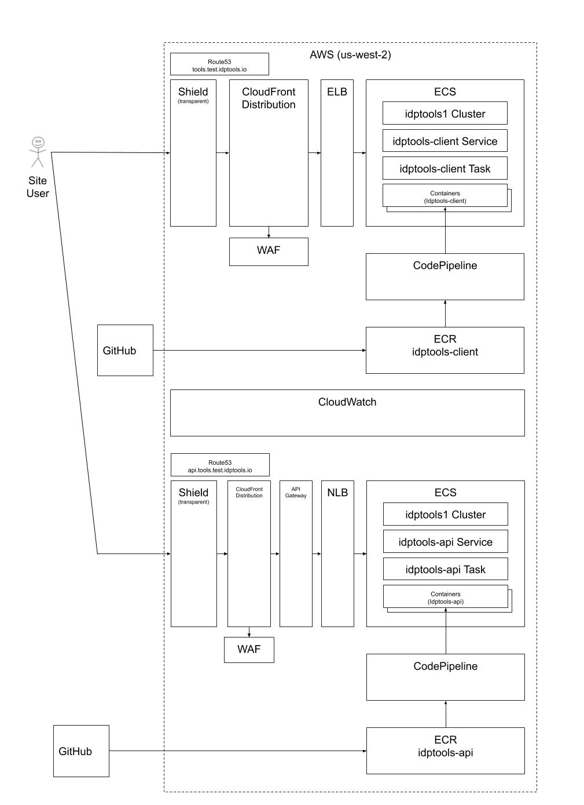

# OAuth2 + OpenID Connect (OIDC) Debugger
This is the private repo with configuration settings necessary for deployment to AWS.

[This](https://github.com/rcbj/oauth2-oidc-debugger) is the official home of the community Project.

This is a simple OAuth2 and OpenID Connect (OIDC) debugger (test tool) that I created as part of a Red Hat SSO blog post I wrote in November, 2017.  Since then, I have expanded support to include several major Identity Providers (see the complete list below). The blog post uses this debugger for testing the OpenID Connect setup.  So, checkout the blog for usage examples. This project builds a docker container that runs the debugger application.

# CICD Pipeline

There are actually two separate ECR repos. Both are upated by the same Github.com Action that builds the docker container images and pushes them to AWS.

GitHub Actions + Workflow is used to build the docker image and push it to an AWS ECR workflow when the master branch is updated.

An AWS CodePipeline is used to push the docker image to the ECS Service whenever the "latest" image is updated.

# Site Architecture

# Supported Specs
This project currently supports the following specs:
* [RFC 6749](https://tools.ietf.org/html/rfc6749)
* [OpenID Connect Core 1](https://openid.net/specs/openid-connect-core-1_0.html)
* [OpenID Connect Discovery v1.0](https://openid.net/specs/openid-connect-discovery-1_0.html)
* [JWT RFC](https://tools.ietf.org/html/rfc7519)

With the ability to add custom parameters to the Authorization Endpoint call and Token Endpoint call, numerous other protocols can be supported. We'll eventually get around to adding direct support.

It also supports a couple of proprietary IdP extensions as described below.
# Supported OAuth2 Authorization Grants
The following OAuth2 Authorization Grants are supported:
* Authorization Code Grant
* Implicit Code Grant
* Resource Owner Password Grant
* Client Credentials Grant

# Supported OIDC Grants
The following OpenID Connect Authentication Flows are supported
* Authorization Code Flow (could also use Authorization Code Grant option and scope="openid profile")
* Implicit Flow (2 variants)
* Hybrid Flow (3 variants)

# Tested Platforms
So far, this tool has been tested with the following OAuth2 or OIDC implementations:

* Red Hat SSO v7.1 (OAuth2 + OIDC)
* 3Scale SaaS with self-managed APICast Gateway (OAuth2 + OIDC)
* Azure Active Directory (v1 endpoints, OIDC + OAuth2)
* Apigee Edge (OAuth2, with caveats described [here](https://medium.com/@robert.broeckelmann/demo-apigee-edge-oauth2-debugging-a10223eb334))
* Ping Federate (OAuth2 + OIDC)
* AWS Cognito (OAuth2 + OIDC)
* Facebook (OAuth2)
* Google+ (OAuth2)
* KeyCloak (reported to work by third-parties, Red Hat SSO v7.1 is KeyCloak under the Red Hat banner, so it should work)

# 3Scale Usage Notes
The version of 3Scale SaaS + APICast only supports OAuth2; 3Scale can support the OIDC Authorization Code Flow since the response_type and grant_type values match OAuth2's Authorization Code Grant.  The other OIDC Authentication Flows are not supported by 3Scale OAuth2.  The latest version of 3Scale on-premise has OIDC support.  As of 12/3/2017, I haven't been able to test this yet.

# Azure Active Directory Usage Notes
Azure Active Directory (v1 endpoints) support OIDC Authorization Code Flow, Implicit Flow, and the Hybrid Flow with response_type="code id_token".

# Apigee Edge Usage Notes
Apigee Edge supports OAuth2 by providing the building blogs of an OAuth2 Provider.  The developer has much leeway in how the pieces are used.  This debugger can only be used with Identity Providers that adhere to the spec.

# AWS Cognito Usage Notes
AWS Cognito has been tested with the OIDC Authorization Code Flow (with a user defined in a user pool and with a facebook federation relationship. Cognito supports federation, but has optional parameters that need to be passed in to tell Cognito which Userpool and Identity Provider to use (like Facebook). The debugger does not support passing in these parameters at this time (we'll call that a future enhancement). It appears to have worked because I tested in a browser session where I had previously authenticated against Cognito using Facebook. Also, when the refresh grant is used, it works without issue the first time; however, the refresh grant response does not include a new refresh token. So, the refresh_token is not prepopulated correctly. The original refresh token can be copied into the field and subsequent refresh token calls will work. I admit I didn't test all possible scenarios, but I imagine that once the refresh token expires, it will issue a new refresh token. Another interesting note that mattered a lot in a recent project, each refresh token grant response has a new ID Token--and, access token, of course.

# Facebook Usage Notes
Facebook OAuth2 was tested with the OAuth2 Authorization Code Grant. It worked, but there was no refresh token provided in the OAuth2 Token Endpoint response. So, the refresh grant is obviously not going to work. Configuration details can be found [here](https://developers.facebook.com/docs/facebook-login/manually-build-a-login-flow). 

# Google+ Usage Notes
Google+ login was tested with the Authorization Code3 Grant. It worked. No refresh token was provided. Configuration details can be found [here](https://developers.google.com/identity/protocols/OAuth2WebServer).

# General Usage Notes

Note, that all configuration values except for the user password is written to local storage to prepopulate fields later.  If this is not desired, clear your browser's local storage for the debugger when done using.

The debugger has been tested with recent versions of Chrome.

## Getting Started
If you have docker installed already:
```
git clone https://github.com/rcbj/oauth2-oidc-debugger.git
cd oauth2-oidc-debugger
docker-compose up
```
Note, you will need at least 950MB of disk space ree in order to build this Docker image.

From a bash command prompt on Fedora or RHEL 7.x, run the following::
``` yum install git
 git clone https://github.com/rcbj/oauth2-oidc-debugger.git
 yum install docker
 system start docker
 cd oauth2-oidc-debugger/client
 docker build -t oauth2-oidc-debugger .
 docker run -p 3000:3000 oauth2-oidc-debugger 
```
# Clean Up / Start Over
* List all containers (only IDs) ```sudo docker ps -aq```
* Stop all running containers: ```sudo docker stop $(docker ps -aq)```
* Remove all containers: ```sudo docker rm $(docker ps -aq)```
* Remove all images: ```sudo docker rmi $(docker images -q)```

On other systems, the commands needed to start the debugger in a local docker container will be similar. The docker Sinatra/Ruby runtime will have to be able to establish connections to remote IdP endpoint (whether locally in other docker containers, on the host VM, or over the network/internet). On the test system, it was necessary to add "--net=host" to the "docker run" args. The network connectivity details for docker may vary from platform-to-platform.

### Running
* Open your favorite browser and enter "http://localhost:3000" in the address bar.
* Choose the OAuth2 Grant or OIDC Flow that you want to test.
* Enter the Authorization Endpoint.
* Enter the Token Endpoint.
#### OAuth2 AUthorization Grant:
* Enter the client identifier.
* Enter the Redirect URI.
* Enter the scope information.
* If you need to provide a resource parameter, click the radio button.  Then, enter the desired resource parameter.
* Click the Authorize button.  
* Authenticate the user.
* Scroll down to the "Exchange Authoriztaion Code for Access Token" Section.
* Verify that the Code field is filled in below in the Token Step section.
* Enter the client identifier
* Enter the client secret if this is a confidential client.
* Enter the scope information.
* If a resource is needed, click Yes.  Enter the resource information in the Resource field.
* If the IdP is using a self-signed certificate or a cert issued from a non-public CA, click No next to the "Validate IdP Certificate?" question.  Note, certificates signed by public CAs are validated against the trusted CAs included with the Ruby 2.4.0 docker image.
* Click the Get Token button.
* The standard tokens that are returned from the token endpoint are displayed at the bottom.
#### OAuth2 Implicit Grant:
* Enter the client identifier.
* Enter the Redirect URI.
* Enter the scope information.
* If you need to provide a resource parameter, click the radio button.  Then, enter the desired resource parameter.
* Click the Authorize button.
* Authenticate the user.  
* The access_token will be listed at the bottom of the screen.
#### Refresh Token Grant
 * In the configuration section, click the the "Yes" radio button next to "Use Refresh Token".  This will make the Refresh Token Section appear.
 * The refresh token is automatically populated from the Token Endpoint call response.
 * Enter the client identifier.
 * Enter the client secret.
 * Enter the scope.
 * Press Enter.
For the other grants and flows, similar steps to the above are used.

See the blog [posts](https://medium.com/@robert.broeckelmann/red-hat-sso-and-3scale-series-d904f2127702) for more information.

## Prerequisites

To run this project you will need to install docker.

## Building the docker image
``` yum install git
 git clone https://github.com/rcbj/oauth2-oidc-debugger.git
 yum install docker
 system start docker
 cd oauth2-oidc-debugger/client
 docker build -t oauth2-oidc-debugger .
 docker run -p 3000:3000 oauth2-oidc-debugger 
```
On other systems, the commands needed to start the debugger in a local docker container will be similar. The docker Sinatra/Ruby runtime will have to be able to establish connections to remote IdP endpoint (whether locally in other docker containers, on the host VM, or over the network/internet).  On the test system, it was necessary to add "--net=host" to the "docker run" args. The network connectivity details for docker may vary from platform-to-platform.

# Additional Feature Information
## State Parameters
* A state parameter can be submitted as part of the authorization endpoint request. The state parameter will be validated when the redirect comes back to the registered callback endpoint. A UUID is used as the state value. This is an optional, but recommended parameter.
## Custom Parameters
Various specs & RFCs that build on the OAuth2 & OIDC protocols add additional parameters that must be passed to the Authorization Endpoint and Token Endpoint. The debugger supports passing up to ten custom parameters.
## Nonce Parameter
A nonce parameter can be included in the Authorization Endpoint call. A UUID is used as the nonce value.

## Token Details
All tokens (Access, Refresh, ID) returned by the IdP can have their details viewed by clicking on the link next to the token on the Debugger2 page.

This feature currently only supports JWT tokens, but in the future will support other token types.

Some caveats to keep in mind:

* If nothing is displayed, then the requested token retrieved from the endpoint is not a JWT or not a valid JWT.
* In the future, additional token formats may be added.
* Although, many leading IdPs use JWT as the format for OAuth2 access tokens and refresh tokens. The spec does not require this.
* Some IdPs intentionally use opaque tokens that have no deeper meaning than to be a randomly generated identifier that points back to session information stored on the IdP

# Application Logs
Logs are generally kept in AWS CloudWatch.

The idptools-client and idptools-api container logs are written to CloudWatch under log groups of the same name. Make sure you are in the correct region.

The AWS API Gateway logs to a CloudWatch log group named as API-Gateway-Execution-Logs_${API_ID}/{STAGE}. These logs roll every so often, but the log messages pertaining to a single API GW request are in a single file.

The CloudFront logs are stored on an S3 bucket. These logs can be pulled into an Athena Database per the instructions available [here](https://docs.aws.amazon.com/athena/latest/ug/cloudfront-logs.html#create-cloudfront-table). These queries are already setup in the us-west-2 region for the Test environment.

# CloudWatch Canary
There are CloudWatch canaries checking the availability of the public API Gateway and public UI sites once per minute.

## Version History
* v0.1 - Red Hat SSO support including all OAuth2 Grants and OIDC Authorization Code Flow
* v0.2 - 3Scale + APICast support for all OAuth2 Grants and OIDC Authorization Code Flow
* v0.3 - Azure Active Directory support for OAuth2 Grans and OIDC Authorization Code Flow.  Added error reporting logic and support for optional resource parameter.  Added additional debug logging code in client.  Moved Token Endpoint interaction into server-side (Ruby/Sinatra/Docker); this was necessary because Azure Active Directory does not support CORS (making Javascript interaction from a browser impossible).  Disabled IdP server certificate validation in IdP call.
* v0.4 - Full OpenID Connect support (all variations of Implicit and Hybrid Flows).  Support for public clients (ie, no client secret).
* v0.5 - Refresh Token support. Updates to UI.

## Authors

Robert C. Broeckelmann Jr. - Initial work

## License

This project is licensed under the Apache 2.0 License - see the LICENSE.md file for details

## Acknowledgments
Thanks to the following:
* [APICast (3Scale API Management Gateway OAuth2 Example)](https://github.com/3scale/apicast/tree/master/examples/oauth2) for being the starting point for this experiment.
* [Docker](https://docker.com)
* Node.js
* Typesccript
* Browserify
* AWS ECS
* AWS ECR
* AWS CodeDeploy
