# OAuth2 + OpenID Connect (OIDC) Debugger
[This](https://github.com/rcbj/oauth2-oidc-debugger) is the official home of the community Project.

This is a simple OAuth2 and OpenID Connect (OIDC) debugger (test tool) that I created as part of a Red Hat SSO blog post I wrote in November, 2017.  Since then, I have expanded support to include several major Identity Providers (see the complete list below). The blog post uses this debugger for testing the OpenID Connect setup.  So, checkout the blog for usage examples. This project builds a docker container that runs the debugger application.

# Supported Specs & Features
This project currently supports the following specs & features:
* [OAuth2 - RFC 6749](https://tools.ietf.org/html/rfc6749)
* [OAuth2 Refresh Token Support](https://www.rfc-editor.org/rfc/rfc6749#section-6)
* [OAuth2 application authentication with client_id and client_secret via POST body or Basic Auth (rather than client cert or dsig).](https://www.rfc-editor.org/rfc/rfc6749#section-2.3.1)
* [OpenID Connect Core 1](https://openid.net/specs/openid-connect-core-1_0.html)
* [OpenID Connect Discovery v1.0](https://openid.net/specs/openid-connect-discovery-1_0.html)
* [JWT RFC](https://tools.ietf.org/html/rfc7519)
* [PKCE - RFC 7636](https://www.rfc-editor.org/rfc/rfc7636)
* [OIDC RP-Initiated Logout v1.0](https://openid.net/specs/openid-connect-rpinitiated-1_0.html)
* [OAuth2 Token Introspection Endpoint (RFC7662)](https://www.rfc-editor.org/rfc/rfc7662) -- client_credentials (basic auth) or bearer token [RFC6750](https://www.rfc-editor.org/rfc/rfc6750) authentication.
* [OAuth2 Device Authorization Grant - RFC8628](https://www.rfc-editor.org/info/rfc8628/) -- Ever registered an app on your television where it jumped ot your phone? This was probably what was used.
* [OAuth2 Token Exchange - RFC8693](https://www.rfc-editor.org/rfc/rfc8693.html) -- Basic support. Currently only tested  with Keycloak v26.x.
* [OAuth2 Token Revocation - RFC7009](https://www.rfc-editor.org/info/rfc7009/)
* [OIDC Dynamic Client Registration spec and RFC 7591 / RFC 7592)](https://www.rfc-editor.org/info/rfc7591/)
* With the ability to add custom parameters to the Authorization Endpoint call and Token Endpoint call, numerous other protocols can be supported. We'll eventually get around to adding direct support.
* Token Endpoint calls can be initiated from the front-end or back-end depending on what the IdP requires in various use cases.
* The client_id and client_secret can be submitted to the Token Endpoint via POST body or Authorization Request Header.

It also supports a couple of proprietary IdP extensions as described below.
# Supported OAuth2 Authorization Grants
The following OAuth2 Authorization Grants are supported:
* [Authorization Code Grant](https://medium.com/@robert.broeckelmann/openid-connect-authorization-code-flow-with-red-hat-sso-d141dde4ed3f)
* [Implicit Code Grant](https://medium.com/@robert.broeckelmann/oauth2-implicit-grant-with-red-hat-sso-v7-1-234810b0ea6f)
* [Resource Owner Password Grant](https://medium.com/@robert.broeckelmann/red-hat-sso-v7-1-oauth2-resource-owner-password-credential-grant-support-6ee40f047f31)
* [Client Credentials Grant](https://medium.com/@robert.broeckelmann/red-hat-sso-v7-1-oauth2-client-credentials-grant-6c64e5ec8bc1)
* [Refresh Grant](https://medium.com/@robert.broeckelmann/refresh-token-support-in-oauth2-oidc-debugger-c792b3a3f65a)
* [Device Authorization Grant](https://www.rfc-editor.org/info/rfc8628/)

# Supported OIDC Authentication Flows
The following OpenID Connect Authentication Flows are supported
* Authorization Code Flow (could also use Authorization Code Grant option and scope="openid profile")
* Implicit Flow (2 variants)
* Hybrid Flow (3 variants)

# AI Coding Tool Disclosure
As of Q1, 2026, Anthropic Claude was used to implement some new features of this project. All code is reviewed by a human before being merged into the main branch.

# Tested Platforms
So far, this tool has been tested with the following OAuth2 or OIDC implementations:

* Red Hat SSO v7.1 (OAuth2 + OIDC)
* 3Scale SaaS with self-managed APICast Gateway (OAuth2 + OIDC)
* Azure Active Directory / EntraId (v1 endpoints, OIDC + OAuth2)
* Azure Active Directory / EntraId (v2 endpoints, OIDC + OAuth2)
* Apigee Edge (OAuth2, with caveats described [here](https://medium.com/@robert.broeckelmann/demo-apigee-edge-oauth2-debugging-a10223eb334))
* Ping Federate (OAuth2 + OIDC)
* AWS Cognito (OAuth2 + OIDC)
* Facebook (OAuth2)
* Google STS (OAuth2 + OIDC)
* KeyCloak (recent versions used in our automated test suite, Red Hat SSO is KeyCloak under the Red Hat banner, so it should work)
* Okta (OIDC + OAuth2)
* Auth0 (OIDC + OAuth2)

# 3Scale Usage Notes
The version of 3Scale SaaS + APICast only supports OAuth2; 3Scale can support the OIDC Authorization Code Flow since the response_type and grant_type values match OAuth2's Authorization Code Grant.  The other OIDC Authentication Flows are not supported by 3Scale OAuth2.  The latest version of 3Scale on-premise has OIDC support.  As of 12/3/2017, I haven't been able to test this yet.

# Azure Active Directory Usage Notes
Azure Active Directory (v1 endpoints) support OIDC Authorization Code Flow, Implicit Flow, and the Hybrid Flow with response_type="code id_token".

# Apigee Edge Usage Notes
Apigee Edge supports OAuth2 by providing the building blogs of an OAuth2 Provider.  The developer has much leeway in how the pieces are used.  This debugger can only be used with Identity Providers that adhere to the spec.

# AWS Cognito Usage Notes
AWS Cognito has been tested with the OIDC Authorization Code Flow (with a user defined in a user pool and with a facebook federation relationship. Cognito supports federation, but has optional parameters that need to be passed in to tell Cognito which Userpool and Identity Provider to use (like Facebook). The debugger does not support passing in these parameters at this time (we'll call that a future enhancement). It appears to have worked because I tested in a browser session where I had previously authenticated against Cognito using Facebook. Also, when the refresh grant is used, it works without issue the first time; however, the refresh grant response does not include a new refresh token. So, the refresh_token is not prepopulated correctly. The original refresh token can be copied into the field and subsequent refresh token calls will work. I admit I didn't test all possible scenarios, but I imagine that once the refresh token expires, it will issue a new refresh token. Another interesting note that mattered a lot in a recent project, each refresh token grant response has a new ID Token--and, access token, of course.

# Facebook Usage Notes
Facebook OAuth2 was tested with the OAuth2 Authorization Code Grant. It worked, but there was no refresh token provided in the OAuth2 Token Endpoint response. So, the refresh grant is obviously not going to work. Configuration details can be found [here](https://developers.facebook.com/docs/facebook-login/manually-build-a-login-flow). 

# Google+ Usage Notes
Google+ login was tested with the Authorization Code3 Grant. It worked. No refresh token was provided. Configuration details can be found [here](https://developers.google.com/identity/protocols/OAuth2WebServer).

# General Usage Notes

Note, that all configuration values except for the user password is written to local storage to prepopulate fields later.  If this is not desired, clear your browser's local storage for the debugger when done using.

The debugger has been tested with recent versions of Chrome.

## Getting Started
If you have docker / docker-compose installed already:
```
git clone https://github.com/rcbj/oauth2-oidc-debugger.git
cd oauth2-oidc-debugger
sudo CONFIG_FILE=./env/local.js docker-compose build
sudo CONFIG_FILE=./env/local.js docker-compose up
```
Note, you will need at least 950MB of disk space ree in order to build this Docker image.

From a bash command prompt on Fedora or RHEL 7.x, run the following::
```
dnf install git # Or, yum install git
git clone https://github.com/rcbj/oauth2-oidc-debugger.git
dnf install docker
systemctl start docker
cd oauth2-oidc-debugger
sudo CONFIG_FILE=./env/local.js docker-compose build
sudo CONFIG_FILE=./env/local.js docker-compose up
```
# Clean Up / Start Over
This is a nuclear option to cleanup docker. You may not want to do this if you have other important things running on your site.

* List all containers (only IDs) ```sudo docker ps -aq```
* Stop all running containers: ```sudo docker stop $(docker ps -aq)```
* Remove all containers: ```sudo docker rm $(docker ps -aq)```
* Remove all images: ```sudo docker rmi $(docker images -q)```
* Prune volumes: ```sudo docker volume prune --all --force```
* Remove all volumes: ```sudo docker volume rm $(sudo docker volume ls | awk '{ print $2 }')```
* Remmove all networks: ```sudo docker network prune -f```

On other systems, the commands needed to start the debugger in a local docker container will be similar. The docker Sinatra/Ruby runtime will have to be able to establish connections to remote IdP endpoint (whether locally in other docker containers, on the host VM, or over the network/internet). On the test system, it was necessary to add "--net=host" to the "docker run" args. The network connectivity details for docker may vary from platform-to-platform.

### Running
* Open your favorite browser and enter "http://localhost:3000" in the address bar.
* Choose the OAuth2 Grant or OIDC Flow that you want to test.
* Enter the Authorization Endpoint.
* Enter the Token Endpoint.
#### OAuth2 AUthorization Grant:
* Enter the client identifier.
* Enter the Redirect URI (use http://localhost:3000/callback by default)
* Enter the scope information.
* If you need to provide a resource parameter, click the radio button.  Then, enter the desired resource parameter.
* Click the Authorize button.  
* Authenticate the user.
* Scroll down to the "Exchange Authoriztaion Code for Access Token" Section.
* Verify that the Code field is filled in below in the Token Step section.
* Enter the client identifier
* Enter the client secret if this is a confidential client.
* Enter the scope information.
* If a resource is needed, click Yes.  Enter the resource information in the Resource field.
* If the IdP is using a self-signed certificate or a cert issued from a non-public CA, click No next to the "Validate IdP Certificate?" question.  Note, certificates signed by public CAs are validated against the trusted CAs included with the Ruby 2.4.0 docker image.
* Click the Get Token button.
* The standard tokens that are returned from the token endpoint are displayed at the bottom.
#### OAuth2 Implicit Grant:
* Enter the client identifier.
* Enter the Redirect URI  (use http://localhost:3000/callback by default)
* Enter the scope information.
* If you need to provide a resource parameter, click the radio button.  Then, enter the desired resource parameter.
* Click the Authorize button.
* Authenticate the user.  
* The access_token will be listed at the bottom of the screen.
#### Refresh Token Grant
 * In the configuration section, click the the "Yes" radio button next to "Use Refresh Token".  This will make the Refresh Token Section appear.
 * The refresh token is automatically populated from the Token Endpoint call response.
 * Enter the client identifier.
 * Enter the client secret.
 * Enter the scope.
 * Press Enter.
For the other grants and flows, similar steps to the above are used.

See the blog [posts](https://medium.com/@robert.broeckelmann/red-hat-sso-and-3scale-series-d904f2127702) for more information.

## Running tests
To run the docker-based tests locally, run the following commmand:
```sudo CONFIG_FILE=./env/local.js docker compose -f docker-compose-run-tests.yml up --abort-on-container-exit```
To run tests locally, run: ```./local-run-tests.sh```

If you need to pop up the browser for troubleshooting, pass in the --browser option to the test scripts.

To generate a code coverage report, run ```./run-coverage.sh```. The report will be under the coverage directory.
## Prerequisites

To run this project you will need to install docker.

## Building the docker image
``` yum install git
 git clone https://github.com/rcbj/oauth2-oidc-debugger.git
 yum install docker
 system start docker
 cd oauth2-oidc-debugger/client
 sudo docker build -t rcbj/debugger-client --build-arg CONFIG_FILE=./env/local.js -f client/Dockerfile .
 sudo docker run -p 3000:3000 -e CONFIG_FILE=./env/local.js -d rcbj/debugger-client
 sudo docker build -t rcbj/debugger-api --build-arg CONFIG_FILE=./env/local.js -f api/Dockerfile .
 sudo docker run -p 4000:4000 -e CONFIG_FILE=./env/local.js -d rcbj/debugger-api
```
On other systems, the commands needed to start the debugger in a local docker container will be similar. The docker Sinatra/Ruby runtime will have to be able to establish connections to remote IdP endpoint (whether locally in other docker containers, on the host VM, or over the network/internet).  On the test system, it was necessary to add "--net=host" to the "docker run" args. The network connectivity details for docker may vary from platform-to-platform.

# Additional Feature Information
## State Parameters
* A state parameter can be submitted as part of the authorization endpoint request. The state parameter will be validated when the redirect comes back to the registered callback endpoint. A UUID is used as the state value. This is an optional, but recommended parameter.
## Custom Parameters
Various specs & RFCs that build on the OAuth2 & OIDC protocols add additional parameters that must be passed to the Authorization Endpoint and Token Endpoint. The debugger supports passing up to ten custom parameters.
## Nonce Parameter
A nonce parameter can be included in the Authorization Endpoint call. A UUID is used as the nonce value.

## Token Details
All tokens (Access, Refresh, ID) returned by the IdP can have their details viewed by clicking on the link next to the token on the Debugger2 page.

This feature currently only supports JWT tokens, but in the future will support other token types.

There are two views: raw-JSON or table view.

The table view will display a claim description for spec-defined claims.

Some caveats to keep in mind:

* If nothing is displayed, then the requested token retrieved from the endpoint is not a JWT or not a valid JWT.
* In the future, additional token formats may be added.
* Although, many leading IdPs use JWT as the format for OAuth2 access tokens and refresh tokens. The spec does not require this.
* Some IdPs intentionally use opaque tokens that have no deeper meaning than to be a randomly generated identifier that points back to session information stored on the IdP

## OIDC RP-Initiated Logout Spec Support
If the Logout URL can be read from the OIDC Discovery Endpoint, it will be automatically populated; otherwise, you will need to manually copy in this URL.

The associated refresh token should be invalidated at this point. The corresponding JWT tokens could still be validated unless you compare them against the Introspection Endpoint.

## JWT Validation
The detail view screen for tokens can validate a JWT token signature.

It can take a JWKS Endpoint or certificate directly.

## JWT Tools
The **JWT Tools** page (`/jwt_tools.html`) is a standalone, browser-only workbench for building, signing, encrypting, verifying, and decrypting JSON Web Tokens. It implements JWS ([RFC 7515](https://www.rfc-editor.org/rfc/rfc7515)), JWE ([RFC 7516](https://www.rfc-editor.org/rfc/rfc7516)), JWT ([RFC 7519](https://www.rfc-editor.org/rfc/rfc7519)), and the JOSE algorithms of JWA ([RFC 7518](https://www.rfc-editor.org/rfc/rfc7518)) plus EdDSA ([RFC 8037](https://www.rfc-editor.org/rfc/rfc8037)).

**All cryptography runs in your browser** via the Web Crypto API (`crypto.subtle`). No key material — private keys, HMAC secrets, generated key pairs, or passwords — is ever written to `localStorage` or sent to a server. Because Web Crypto is only available in a *secure context*, use the page over `https://` or `http://localhost`.

Reach it from the **Tools** pane on `debugger.html` or `debugger2.html`, or browse directly to `/jwt_tools.html`. The "← Return to debugger" link sends you back to whichever debugger page you came from. Every multi-line field has a **Copy** button, and hovering any field shows a tooltip describing it.

The page is three side-by-side panes that map to the lifecycle of a token:

| Pane | Title | What it does |
|---|---|---|
| **#1** | Compose | Build the JWT Header and Payload; decode a pasted token |
| **#2** | Sign (JWS) | Generate keys, sign the token, and **validate a signature** |
| **#3** | Encrypt (JWE) | Generate keys, encrypt the token, and **decrypt a JWE** |

The typical order is **Compose (#1) → Sign (#2) → Encrypt (#3)**, and the reverse for inspection: **Decrypt (#3) → Validate signature (#2)**.

### Pane #1 — Compose
Author the token. Three text areas plus helpers:

* **JWT Header** — the JOSE header, as JSON. Pre-populated with a sample (`alg`, `typ`, `kid`).
* **JWT Payload** — the claims set, as JSON. Pre-populated with RFC 7519 registered claims (`iss`, `sub`, `aud`, `exp`, `nbf`, `iat`, `jti`) and placeholder values.
* **Encoded JWT** — the compact-serialized token. This field is **two-way**: editing the Header or Payload rebuilds it as `BASE64URL(header).BASE64URL(payload).` (an *unsigned* token — note the trailing dot); pasting a token into it decodes the header and payload back into the fields on the left. If the pasted token carries a signature, the whole token is also copied into the Sign pane's **JWT to Verify** and **Signed JWT** fields.

A status line reports the sync state or any JSON parse error.

**Add Custom Claim** — insert a claim without hand-editing JSON: enter a **name** and **value**, pick a **value type** (`String`, `Number`, `Boolean`, or `JSON` — the last parses arbitrary JSON), pick a **target** (`Payload` or `Header`), and click **Add**.

**Buttons:**
* **Generate RFC 9068 Token** — overwrites the Header/Payload/Encoded JWT with a sample OAuth 2.0 JWT access token ([RFC 9068](https://www.rfc-editor.org/rfc/rfc9068)): header `typ` is `at+jwt` with the required access-token claims. The sample is *unsigned* — sign it in Pane #2.
* **JWT RFC Compliance** — validates the current token against the JWT/JWS specs (RFC 7519 / RFC 7515) and writes a PASS/FAIL report to **Compliance Output**.
* **RFC 9068 Compliance** — validates the current token specifically as an OAuth 2.0 JWT access token.

### Pane #2 — Sign (JWS)
Generate a signing key pair (or HMAC secret), sign the composed token, and validate signatures. **The Signing Algorithm dropdown drives everything in this pane** — it determines what key material *Generate Keys* produces and how the token is signed.

| Option | Family | Key generated |
|---|---|---|
| `RS256` / `RS384` / `RS512` | RSASSA-PKCS1-v1_5 | RSA key pair (size from the Key Size dropdown) |
| `PS256` / `PS384` / `PS512` | RSASSA-PSS | RSA key pair (size from the Key Size dropdown) |
| `ES256` / `ES384` / `ES512` | ECDSA | EC key pair on P-256 / P-384 / P-521 |
| `EdDSA` | EdDSA (RFC 8037) | OKP key pair on Ed25519 |
| `HS256` / `HS384` / `HS512` | HMAC (symmetric) | a random shared secret (no key pair) |

> The dropdown is read when you click a button and is **not "sticky"** to already-generated keys. Pick the algorithm *first*, then Generate Keys → Sign. If you switch to a different algorithm family after generating keys, regenerate them before signing.

**Key generation & display:**
* **Generate Keys** — creates key material for the selected algorithm and fills the key fields.
* **RSA Key Size** — for the RSA families (`RS*`/`PS*`), selects the modulus size: **2048** (default), **3072**, **4096**, or **1024** (insecure). Ignored for EC, EdDSA, and HMAC, whose sizes follow the chosen curve/algorithm.
* **Private Key (PKCS#8) / HMAC Secret** and **Public Key (SPKI)** — the key pair (HMAC shows only a base64url secret; the public field carries a notice). You may also paste your own PEM or JWK material.
* **Show keys as JWK (off = PEM)** — a toggle that converts *both* key fields between PEM (default) and JWK in place.

**Downloading keys:** choose a **Keystore format** (`PEM`, `JWK`, `DER`, `PKCS#12`) and an optional **Password** (which encrypts the private key: PBES2-encrypted PEM/DER, a PBES2 JWE for JWK, and *required* for PKCS#12), then **Download Keys**. DER produces two files (private + public). *PKCS#12 export is not available for EdDSA keys in-browser — use PEM, DER, or JWK.*

**Signing:** **Generate Signed JWT** signs `BASE64URL(header).BASE64URL(payload)` with the Private Key / HMAC Secret and forces the header `alg` to match your selection. The result is written to **Signed JWT** (read-only), the **Encoded JWT** box in Pane #1, the **JWT to Verify** box below, and the **Payload to Encrypt** box in Pane #3 (ready to nest inside a JWE).

**Validate a Signature (sub-section):** verify any JWS — the one you just produced or one you paste in.
1. **JWT to Verify** — defaults to the just-signed token. Verification uses the **`alg` in the pasted token's header**, not the dropdown above.
2. **Verification Type**:
   * `HMAC Secret` — verify a symmetric (`HS*`) signature with the secret.
   * `X.509 Certificate (PEM)` — verify with a public key / certificate (auto-populated from the public key you generated).
   * `JWKS (JSON)` — paste a JWKS document; the key is chosen by the token's `kid`. *(Currently supports RSA keys.)*
   * `JWKS (URL)` — same, but the JWKS is fetched from a URL.
3. **Verification Key / URL** — the secret, PEM/cert, JWKS JSON, or URL.
4. **Verify** — writes `Signature Verified: true|false` (or an error) to **Verification Output**.

### Pane #3 — Encrypt (JWE)
Encrypt the token (or any payload) into a JWE, and decrypt JWEs. JOSE encryption uses two algorithms: a **key-management** algorithm (`alg`, which uses the recipient's key pair) and a **content-encryption** algorithm (`enc`, which encrypts the body with a symmetric Content Encryption Key).

**Key Management (`alg`):**

| Option | Mechanism | Recipient key |
|---|---|---|
| `RSA-OAEP` | RSA-OAEP (SHA-1), wraps a random CEK | RSA key pair |
| `RSA-OAEP-256` | RSA-OAEP (SHA-256), wraps a random CEK | RSA key pair |
| `ECDH-ES` | ECDH key agreement, *direct* (the agreed key is the CEK) | EC key pair (P-256) |
| `ECDH-ES+A128KW` / `+A192KW` / `+A256KW` | ECDH agreement derives a key-wrapping key that AES-KW-wraps a random CEK | EC key pair (P-256) |

**Content Encryption (`enc`):** `A256GCM`, `A192GCM`, `A128GCM` (AES-GCM authenticated encryption).

**Key generation & display:** **Generate Keys** creates the recipient key pair for the selected key-management algorithm (RSA for `RSA-OAEP*`; EC P-256 for all `ECDH-ES*`), shown as **Recipient Public Key (SPKI)** and **Recipient Private Key (PKCS#8)**. A **RSA Key Size** dropdown (**2048** default / **3072** / **4096**, or **1024** insecure) sets the modulus for the `RSA-OAEP*` algorithms and is ignored for `ECDH-ES*`. The **Show keys as JWK** toggle and the keystore **format / password / Download Keys** controls behave exactly as in Pane #2.

**Encrypting:** **Payload to Encrypt** defaults to the Signed JWT from Pane #2 (a nested JWT); you can encrypt any text. **Encrypt JWT** produces a 5-part compact JWE (`protected.encrypted_key.iv.ciphertext.tag`) using the recipient **public** key, the selected `alg`/`enc`, and a fresh random IV. If the payload is itself a JWS, the protected header is marked `cty:"JWT"` (RFC 7519 §5.2); for `ECDH-ES*` the ephemeral public key is added as `epk`. The result is written to **Encrypted JWT (JWE)**, the **JWE to Decrypt** box below, and the Encoded JWT box in Pane #1. Encryption adds the JWE parameters (`enc`, `cty`, `epk`, …) to the Pane #1 Header but **preserves** the JWS signing `alg` (a JWS `alg` and a JWE `alg` are distinct header parameters).

**Decrypt a JWE (sub-section):** **JWE to Decrypt** defaults to the JWE you just produced (paste any compact JWE); decryption uses the **Recipient Private Key** above. **Decrypt JWT** recovers the plaintext (for a nested JWT, the inner JWS) into **Decryption Output**. The `alg`/`enc` are read from the JWE's own protected header.

### Valid algorithm combinations
Signing (Pane #2) is a single choice, while encryption (Pane #3) is a **combination** of a key-management algorithm (`alg`) and a content-encryption algorithm (`enc`). Signing and encryption are independent stages, so a signed-then-encrypted (nested) token can pair *any* signing algorithm with *any* valid encryption combination.

**Signing algorithms (Pane #2)** — 13 standalone choices; pick one:

| Family | Algorithms |
|---|---|
| HMAC (symmetric) | `HS256`, `HS384`, `HS512` |
| RSASSA-PKCS1-v1_5 | `RS256`, `RS384`, `RS512` |
| RSASSA-PSS | `PS256`, `PS384`, `PS512` |
| ECDSA | `ES256` (P-256), `ES384` (P-384), `ES512` (P-521) |
| EdDSA | `EdDSA` (Ed25519) |

**Encryption combinations (Pane #3)** — every `alg` × `enc` pairing is cryptographically valid (18 total). Choose one cell — one Key Management algorithm and one Content Encryption algorithm:

| Key Management (`alg`) ↓ / Content Encryption (`enc`) → | `A128GCM` | `A192GCM` \* | `A256GCM` |
|---|---|---|---|
| `RSA-OAEP` | ✓ | ✓ \* | ✓ |
| `RSA-OAEP-256` | ✓ | ✓ \* | ✓ |
| `ECDH-ES` (P-256, direct) | ✓ | ✓ \* | ✓ |
| `ECDH-ES+A128KW` (P-256) | ✓ | ✓ \* | ✓ |
| `ECDH-ES+A192KW` (P-256) \* | ✓ \* | ✓ \* | ✓ \* |
| `ECDH-ES+A256KW` (P-256) | ✓ | ✓ \* | ✓ |

> **\* AES-192 caveat.** The 192-bit AES algorithms — content encryption `A192GCM` and key management `ECDH-ES+A192KW` — are **not supported in Chromium-based browsers** (Chrome, Edge, and the Selenium test harness) because BoringSSL omits 192-bit AES; attempting them raises a "192-bit AES keys are not supported" error. They work in Firefox and in Node/OpenSSL. If you need broad browser compatibility, use the 128- or 256-bit variants. The other 12 combinations work everywhere.

**Nested (signed + encrypted) tokens.** Because you sign in Pane #2 and then encrypt the resulting JWS in Pane #3, any of the 13 signing algorithms can be nested inside any of the 18 encryption combinations (subject to the AES-192 caveat above).

### End-to-end walkthrough
**Build → sign → encrypt:**
1. **Pane #1 – Compose.** Edit the Header and Payload, or click *Generate RFC 9068 Token*. Optionally check compliance.
2. **Pane #2 – Sign.** Choose a Signing Algorithm, click *Generate Keys*, then *Generate Signed JWT*. The signed token flows into Pane #3's *Payload to Encrypt*.
3. **Pane #3 – Encrypt (optional).** Choose Key Management + Content Encryption, click *Generate Keys*, then *Encrypt JWT* to wrap the signed JWT in a JWE.

**Inspect an existing token — decrypt → validate:**
1. **Pane #3 – Decrypt.** Paste the JWE into *JWE to Decrypt*, provide/generate the recipient private key, and click *Decrypt JWT*. The inner JWS appears in *Decryption Output*.
2. **Pane #1.** Paste the JWS into *Encoded JWT* to decode its header and payload (this also loads it into the Sign pane's *JWT to Verify*).
3. **Pane #2 – Validate a Signature.** Pick the Verification Type, supply the key/JWKS/secret, and click *Verify*.

### Notes & limitations
* **Web Crypto only.** Algorithms are limited to what the browser's Web Crypto API supports. `RSA1_5` (RSAES-PKCS1-v1_5 key management) and Ed448 are spec-defined but unavailable in Web Crypto, and are not offered.
* **HMAC** is symmetric — no key pair, no X.509 form, and JWK-only export.
* **JWKS verification** matches on `kid` and currently supports RSA keys.
* **Secure context required.** `crypto.subtle` is only present over HTTPS or on `localhost`.
* **No persistence.** Keys and secrets live only in the page for the current session.

## Encoding / Hashing Tools
The **Encoding / Hashing Tools** page (`/encoding_tools.html`) is a standalone, browser-only utility for the small conversions that come up constantly when working with tokens: Base64, URI (percent) encoding, checksums, and SHA hashing. Everything runs in your browser and **nothing is stored or sent to a server**.

Reach it from the **Tools** pane on `debugger.html` or `debugger2.html`, or browse directly to `/encoding_tools.html`. The "← Return to debugger" link sends you back to whichever debugger page you came from. Every field has a **Copy** button and a hover tooltip, and on load each *Unencoded value* is pre-populated with a sample and its Encode/hash is run automatically so the *Encoded* fields are filled immediately.

The page has four panes. Each follows the same layout — an **Unencoded value** box, an **Encoded** box, and one or two action buttons — with a status line reporting the result or any error:

| Pane | Title | Buttons | Direction |
|---|---|---|---|
| **#1** | Base64 | Encode, Decode | two-way |
| **#2** | URI Encoding | Encode, Decode | two-way |
| **#3** | Checksum (CRC-32) | Encode | one-way |
| **#4** | SHA Hashing | Encode (+ size dropdown) | one-way |

### Pane #1 — Base64
* **Encode** — Base64-encodes the *Unencoded value* (UTF-8) into the *Encoded* box.
* **Decode** — Base64-decodes the *Encoded* value back into *Unencoded value*.

Uses standard Base64 ([RFC 4648](https://www.rfc-editor.org/rfc/rfc4648), i.e. the `+` / `/` alphabet with `=` padding), not base64url, and is UTF-8 aware. The status line reports the byte count, or a clear error if the *Encoded* text is not valid Base64.

### Pane #2 — URI Encoding
* **Encode** — percent-encodes the *Unencoded value* (equivalent to JavaScript `encodeURIComponent`), so reserved characters such as space, `&`, `=`, `/`, `?`, and `#` become `%NN`.
* **Decode** — reverses it (`decodeURIComponent`).

The status line reports success, or an error for malformed percent-encoding.

### Pane #3 — Checksum (CRC-32)
A checksum is **one-way**, so this pane has only an **Encode** button (no Decode — a checksum cannot be reversed to recover the input). **Encode** computes the CRC-32 (IEEE 802.3, reflected) of the *Unencoded value* and writes it to the read-only *Encoded* box as 8 hexadecimal digits.

CRC-32 is a fast, non-cryptographic *integrity* check (detects accidental corruption). It is **not** a secure hash — do not use it where collision resistance matters.

### Pane #4 — SHA Hashing
Also **one-way** (Encode only). Choose a digest from the size dropdown and click **Encode** to write the hex digest to the read-only *Encoded* box.

| Option | Digest length |
|---|---|
| `SHA-256` (default) | 256-bit (64 hex chars) |
| `SHA-1` | 160-bit (40 hex chars) |
| `SHA-384` | 384-bit (96 hex chars) |
| `SHA-512` | 512-bit (128 hex chars) |

SHA hashing uses the Web Crypto API (`crypto.subtle.digest`), which is only available in a *secure context* — use the page over `https://` or `http://localhost`. `SHA-1` is offered for interoperability with legacy systems but is cryptographically broken; prefer `SHA-256` or larger for security.

### Notes & limitations
* **Base64, URI, and CRC-32** are pure JavaScript and work in any browser (no secure context required). **SHA hashing** requires Web Crypto, hence a secure context.
* **Checksum and SHA are one-way** — there is intentionally no Decode.
* **No persistence** — all values live only in the page for the current session.

## Digital Signature
The **Digital Signature** page (`/digital_signature.html`) is a standalone, browser-only workbench for generating key pairs, signing arbitrary values, and validating signatures across classical, elliptic-curve, and post-quantum schemes.

**All cryptography runs in your browser** using pure-JavaScript libraries — [node-forge](https://github.com/digitalbazaar/forge) (RSA), [`@noble/curves`](https://github.com/paulmillr/noble-curves) (ECC), and [`@noble/post-quantum`](https://github.com/paulmillr/noble-post-quantum) (SLH-DSA / ML-DSA). Signing deliberately does **not** use the Web Crypto API: `crypto.subtle` supports only the SHA family, whereas these panes let you pair RSA/ECDSA with a wide range of hashes. **No key material is stored:** keys live only in this page and are never written to local storage.

Reach it from the **Tools** pane on `debugger.html` or `debugger2.html`, or browse directly to `/digital_signature.html`. Every field has a **Copy** button and a hover tooltip, and the "← Return to debugger" link goes back to whichever page you came from.

The page is four panes, one per algorithm family:

| Pane | Scheme | Algorithms |
|---|---|---|
| **#1** | SLH-DSA (FIPS 205, post-quantum) | 12 parameter sets (SHA2/SHAKE × 128/192/256 × s/f) |
| **#2** | RSA | PKCS#1 v1.5 & PSS, any hash |
| **#3** | ECC | ECDSA (P-256/384/521, secp256k1) any hash; EdDSA (Ed25519/Ed448); Schnorr (BIP-340); BLS (BLS12-381) |
| **#4** | ML-DSA (FIPS 204, post-quantum) | ML-DSA-44 / 65 / 87 |

### Common layout
Every pane has the same controls:
* **Value** — the message to sign or validate (any text).
* **Signature (Base64)** — produced by *Sign*; paste one here to validate.
* **Key Pair** — an algorithm/curve/parameter dropdown, a **Generate Keys** button, and the private + public key fields (PEM for RSA/SLH-DSA/ML-DSA; raw hex for ECC).
* **Download Keys** — a keystore-format dropdown (PEM / JWK / DER / PKCS#12) and an optional password (see the matrix below).
* **Sign** / **Validate Signature** buttons, and a status line reporting the result (`Signature VALID ✓` / `INVALID ✗`) or any error.

> The algorithm/curve dropdown is read at click time and is **not** sticky to already-generated keys — pick the algorithm first, then Generate Keys → Sign. A mismatch is caught and reported in the status line.

### Hashes (RSA and ECDSA)
The RSA pane and the ECDSA curves let you choose the message-digest hash:

| Hash | Status |
|---|---|
| `SHA-256` / `SHA-384` / `SHA-512` | recommended |
| `SHA3-256` / `SHA3-384` / `SHA3-512` | recommended |
| `BLAKE2b-512` | supported (RSA: **PSS only** — no PKCS#1 v1.5 DigestInfo OID) |
| `BLAKE3-256` | supported (RSA: **PSS only** — no PKCS#1 v1.5 DigestInfo OID) |
| `RIPEMD-160` | legacy |
| `SHA-1` | insecure — interop/testing only |
| `MD5` | broken — interop/testing only |

EdDSA, Schnorr, and BLS hash the message internally, so the Hash selection does not apply to them.

### Pane #1 — SLH-DSA
Post-quantum, hash-based signatures (FIPS 205, formerly SPHINCS+). Choose one of the 12 parameter sets, Generate Keys, then Sign / Validate. **Note:** SLH-DSA runs in pure JavaScript, so key generation and especially signing can take several seconds — the small-signature (`s`) and 256-bit sets are the slowest.

### Pane #2 — RSA
RSA signatures with a selectable **Padding** (PKCS#1 v1.5 or PSS) × **Hash** (any of the above). A **Key Size** dropdown chooses the RSA modulus — **2048** (default), **3072**, **4096**, or **1024** (insecure); larger sizes are noticeably slower to generate in pure JS. Keys are shown as PEM. Padding math (EMSA-PKCS1-v1_5 / EMSA-PSS with MGF1) is implemented directly over a chosen digest, which is what enables the non-SHA hashes.

### Pane #3 — ECC
Elliptic-curve signatures, selected via the **Curve** dropdown:
* **ECDSA** over `P-256`, `P-384`, `P-521`, and `secp256k1` — with any hash.
* **EdDSA** over `Ed25519` and `Ed448`.
* **Schnorr** (BIP-340, over secp256k1).
* **BLS** (BLS12-381).

Keys are shown as raw hex. Signatures are Base64.

### Pane #4 — ML-DSA
Post-quantum, lattice-based signatures (FIPS 204, formerly CRYSTALS-Dilithium) — the primary NIST post-quantum signature standard. Choose `ML-DSA-44`, `65`, or `87`, Generate Keys, then Sign / Validate. Unlike SLH-DSA, signing is fast.

### Keystore download support
An optional password encrypts the private material: PBES2 for PEM/DER (RSA), a PBES2 JWE for JWK, and native for PKCS#12. Not every key type supports every format — unsupported combinations report a clear status message rather than emit a broken file:

| Pane | PEM | DER | JWK | PKCS#12 |
|---|---|---|---|---|
| RSA | ✓ (encrypted PKCS#8 w/ password) | ✓ | ✓ | ✓ (password required) |
| ECC — ECDSA / EdDSA | ✗ | ✗ | ✓ | ✗ |
| ECC — Schnorr / BLS | ✗ | ✗ | ✗ (copy the hex) | ✗ |
| SLH-DSA / ML-DSA | ✓ (raw, unencrypted) | ✗ | ✓ | ✗ |

### Notes & limitations
* **Pure JS, not Web Crypto** — chosen so RSA/ECDSA can use non-SHA hashes. (PBES2 for JWK password protection does use Web Crypto, which is fine — it's unrelated to the signing hash.)
* **Interoperability** — standard combinations (RSA/ECDSA with SHA-2/SHA-3, EdDSA) verify against other tools; exotic ones (RIPEMD-160, BLAKE2b, BLAKE3, some curve+hash pairings) may not be accepted elsewhere, as they go beyond the JOSE/PKIX registries.
* **Not offered** (no maintained pure-JS/CJS support): Falcon/FN-DSA, finite-field DSA, Brainpool curves, SM2, GOST.
* **No persistence** — keys and signatures live only in the page for the current session.

## Version History
* v0.1 - Red Hat SSO support including all OAuth2 Grants and OIDC Authorization Code Flow
* v0.2 - 3Scale + APICast support for all OAuth2 Grants and OIDC Authorization Code Flow
* v0.3 - Azure Active Directory support for OAuth2 Grans and OIDC Authorization Code Flow.  Added error reporting logic and support for optional resource parameter.  Added additional debug logging code in client.  Moved Token Endpoint interaction into server-side (Ruby/Sinatra/Docker); this was necessary because Azure Active Directory does not support CORS (making Javascript interaction from a browser impossible).  Disabled IdP server certificate validation in IdP call.
* v0.4 - Full OpenID Connect support (all variations of Implicit and Hybrid Flows).  Support for public clients (ie, no client secret).
* v0.5 - Refresh Token support. Updates to UI.
* v0.6 - Rewritten in JavaScript. Ported to AWS for idptools.io website. Numerous enhancements. See Release Notes.
* v0.7 - PKCE Support added.
* v0.8 - Added Selenium-based test suite. Token Endpoint calls can be initiated from frontend or backend. Numerous new features.

## Authors

Robert C. Broeckelmann Jr. - Initial work

## License

This project is licensed under the MIT License - see the LICENSE.md file for details

## Acknowledgments
Thanks to the following:
* [APICast (3Scale API Management Gateway OAuth2 Example)](https://github.com/3scale/apicast/tree/master/examples/oauth2) for being the starting point for this experiment.
* [Docker](https://docs.docker.com/reference/cli/docker/)
* [docker-compose](https://docs.docker.com/reference/cli/docker/compose/)
* Node.js(https://nodejs.org/api/all.html)
* Javascript(https://devdocs.io/javascript/)
* Typescript(https://www.typescriptlang.org/docs/)
* Browserify(https://github.com/browserify/browserify#usage)
* OpenAPI(https://swagger.io/specification/)
* Selenium(https://www.selenium.dev/selenium/docs/api/javascript/index.html)

# Flows
## OAuth2 Client Credentials Grant
1. Open http://localhost:3000
2. Expand "OpenID Connect Discovery Endpoint Information", enter "OIDC Discovery Endpoint URL" and click "Retrieve"
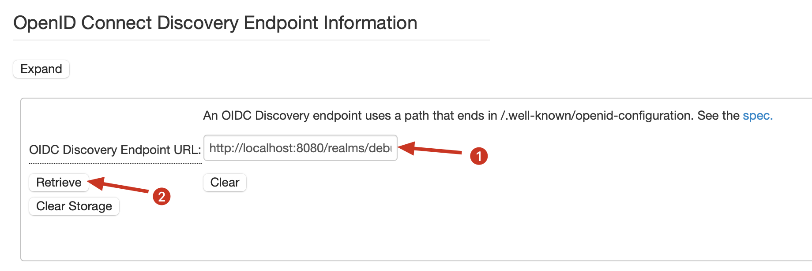
3. Scroll down to end of Discovery Endpoint Information table and click "Populate Meta Data"
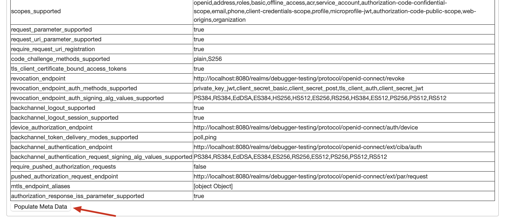
4. Expand "Configuration Parameters" and from "Authorization Grant" select "OAuth2 Client Credential"
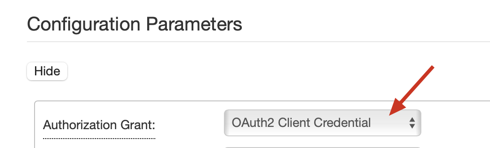
5. In "Exchange Authorization Code for Access Token", enter "Client ID", "Client Secret" and "Scope", then click "Get Token"
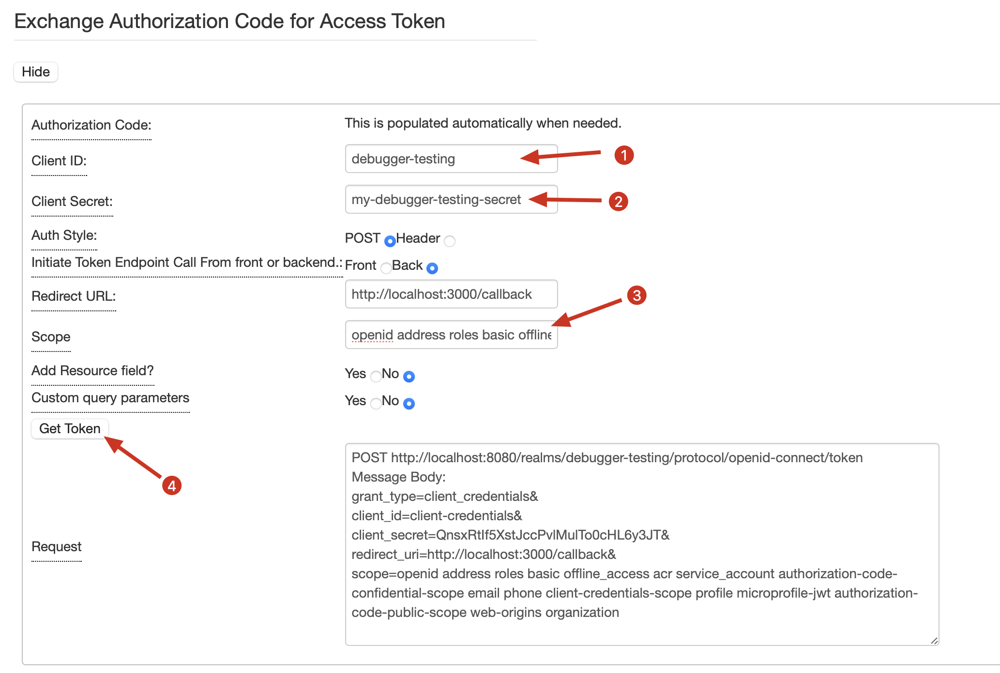
6. If successful, the debugger will return "Access token". You can view additional information for the access token if you click on the "Access token" link
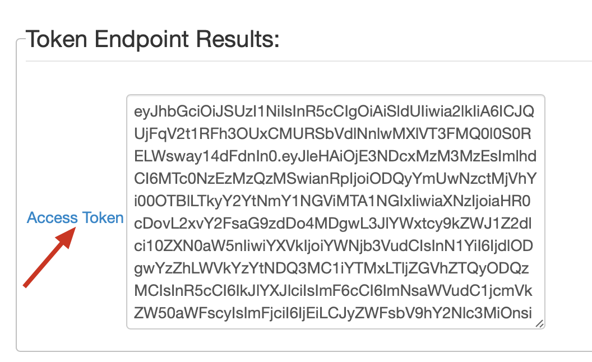
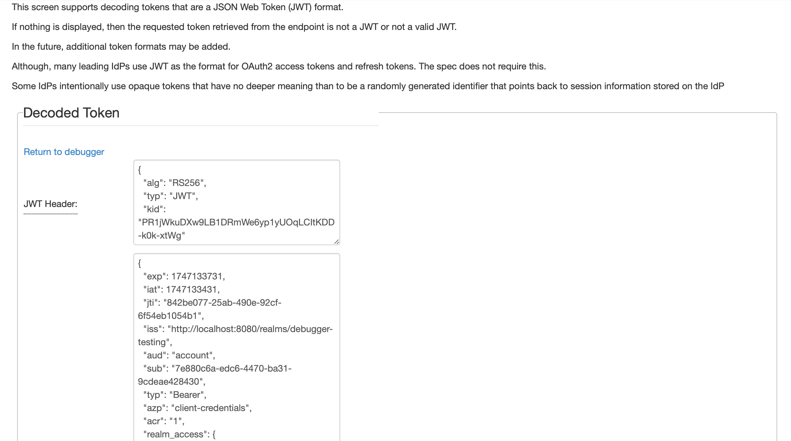

## OIDC Authorization Code Flow
1. Open http://localhost:3000
2. Expand "OpenID Connect Discovery Endpoint Information", enter "OIDC Discovery Endpoint URL" and click "Retrieve"

3. Scroll down to end of Discovery Endpoint Information table and click "Populate Meta Data"

4. Expand "Configuration Parameters" and from "Authorization Grant" select "OIDC Authorization Code Flow(code)"
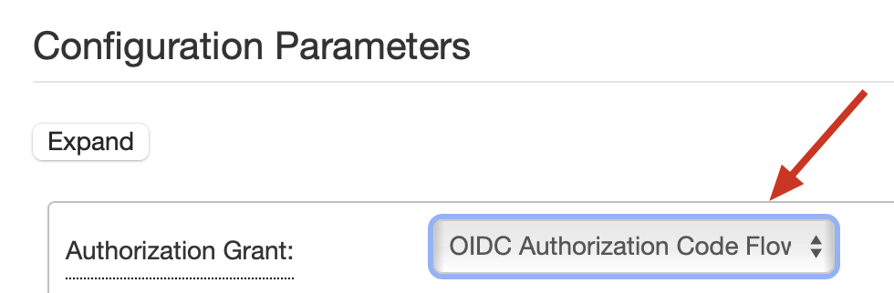
5. Optionally, you can modify the following variables:
- Display OIDC Related Artifacts?
- SSL Certificate Validation
- Use Refresh Token
- Use PKCE
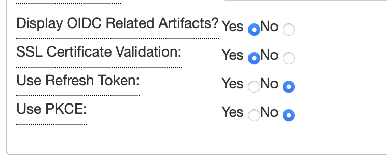
6. In "Request Authorization Code", enter "Client ID" and "Scope", then click "Authorize"
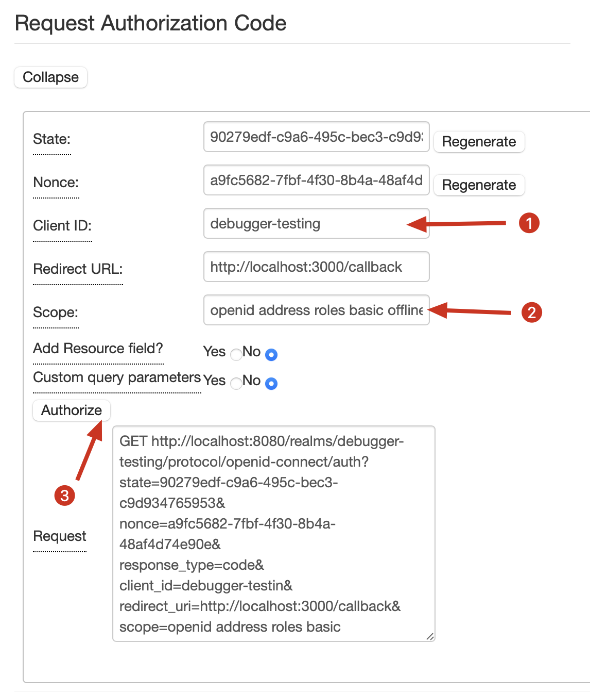
7. In the newly opened tab from the identity provider, enter "Username" and "Password", then click "Sign In"
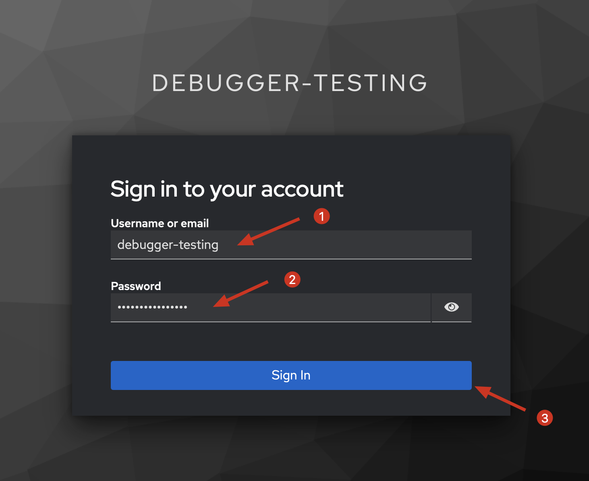
8. On successful login, you will be redirected back to the debugger page
9. In "Exchange Authorization Code for Access Token", enter "Client ID", "Client Secret" (only if client is confidential) and "Scope", then click "Get Token"

10. If successful, the debugger will return "Access token", "Refresh Token" and optionally "ID Token". You can view additional information for each of the tokens if you click on their links (1). You can also introspect the access and refresh token using the identity provider introspection endpoint (2). For ID tokens, you can also decode their userinfo data (3)
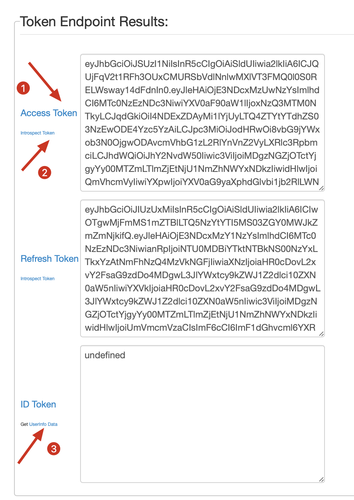
