# OAuth2 + OpenID Connect (OIDC) Debugger
[This](https://github.com/rcbj/oauth2-oidc-debugger) is the official home of the community Project.

This is a simple OAuth2 and OpenID Connect (OIDC) debugger (test tool) that I created as part of a Red Hat SSO blog post I wrote in November, 2017.  Since then, I have expanded support to include several major Identity Providers (see the complete list below). The blog post uses this debugger for testing the OpenID Connect setup.  So, checkout the blog for usage examples. This project builds a docker container that runs the debugger application.

# Supported Specs & Features
This project currently supports the following specs & features:
* [OAuth2 - RFC 6749](https://tools.ietf.org/html/rfc6749)
* [OAuth2 Refresh Token Support](https://www.rfc-editor.org/rfc/rfc6749#section-6)
* [OAuth2 application authentication with client_id and client_secret via POST body or Basic Auth (rather than client cert or dsig).](https://www.rfc-editor.org/rfc/rfc6749#section-2.3.1)
* [OpenID Connect Core 1](https://openid.net/specs/openid-connect-core-1_0.html)
* [OpenID Connect Discovery v1.0](https://openid.net/specs/openid-connect-discovery-1_0.html)
* [JWT RFC](https://tools.ietf.org/html/rfc7519)
* [JWS JSON Web Signature](https://www.rfc-editor.org/info/rfc7515/)
* [JWE JSON Web Encryption](https://www.rfc-editor.org/rfc/rfc7516.html)
* [PKCE - RFC 7636](https://www.rfc-editor.org/rfc/rfc7636)
* [OIDC RP-Initiated Logout v1.0](https://openid.net/specs/openid-connect-rpinitiated-1_0.html)
* [OAuth2 Token Introspection Endpoint (RFC7662)](https://www.rfc-editor.org/rfc/rfc7662) -- client_credentials (basic auth) or bearer token [RFC6750](https://www.rfc-editor.org/rfc/rfc6750) authentication.
* [OAuth2 Device Authorization Grant - RFC8628](https://www.rfc-editor.org/info/rfc8628/) -- Ever registered an app on your television where it jumped ot your phone? This was probably what was used.
* [OAuth2 Token Exchange - RFC8693](https://www.rfc-editor.org/rfc/rfc8693.html) -- Exchange one token for another: impersonation or delegation, with a `subject_token`, an optional `actor_token`, and `audience` / `resource` / `scope` / `requested_token_type`. It has **its own card on the landing page**, which opens `debugger.html` — you need a subject token before you can exchange one, so the exchange pane itself is on the results page (`debugger2.html`). Currently only tested with Keycloak v26.x.
* [OAuth2 Token Revocation - RFC7009](https://www.rfc-editor.org/info/rfc7009/)
* [OIDC Dynamic Client Registration 1.0](https://openid.net/specs/openid-connect-registration-1_0.html) -- a Relying Party registers itself at the OP's registration endpoint, sending its client metadata and getting back a `client_id` (plus a Registration Access Token and `registration_client_uri` for reading the registration back). Read/update/delete of an existing registration follow [RFC 7592](https://www.rfc-editor.org/info/rfc7592/), and the request/response bodies are [RFC 7591](https://www.rfc-editor.org/info/rfc7591/)'s. It has **its own card on the landing page**, which opens the Dynamic Client Registration pane on `debugger.html` — the same page as the OAuth2 / OIDC workflow, because a registration is what that workflow then uses.
* [SAML2](https://www.oasis-open.org/standard/saml/) -- SP-initiated SSO against an IdP, plus a **SAML Assertion Tool** that composes a spec-compliant SAML 1.0 / 1.1 / 2.0 assertion and signs and encrypts it in the browser. See the SAML Assertion Tool section below.
* [SD-JWT — Selective Disclosure for JWTs, RFC 9901](https://www.rfc-editor.org/rfc/rfc9901.html) -- the format the credential workflows below are built on: salted claim Disclosures hashed into an `_sd` array, a Combined Serialization joined by `~`, and a **Key Binding JWT** (section 4.3) whose `sd_hash` commits to exactly the bytes presented. In-browser: nothing is disclosed that you did not tick.
* [SD-JWT VC — SD-JWT-based Verifiable Credentials](https://datatracker.ietf.org/doc/draft-ietf-oauth-sd-jwt-vc/) -- the credential type on top of SD-JWT: a `dc+sd-jwt` typed JWT with a `vct`, an issuer resolvable by `iss` (an HTTPS identifier with JWT VC Issuer Metadata, or a `did:jwk`), and holder binding through `cnf`.
* [OpenID for Verifiable Credential Issuance 1.0 (OID4VCI)](https://openid.net/specs/openid-4-verifiable-credential-issuance-1_0.html) -- the **SD-JWT VC Issuance workflow**: credential issuer metadata (including RFC 8414 well-known *path insertion*), the authorization code and **pre-authorized code** grants, Credential Offers by value / by `credential_offer_uri` / by QR code with a Transaction Code, `authorization_details` → `credential_identifier`, a nonce endpoint and `openid4vci-proof+jwt` proof of possession, batch issuance, deferred issuance, encrypted Credential Responses, the Notification Endpoint, and **credential refresh** (section 14.5). Appendix H use cases H.1, H.2, H.3 and H.6. See the SD-JWT VC Issuance section below.
* [OpenID for Verifiable Presentations 1.0 (OID4VP)](https://openid.net/specs/openid-4-verifiable-presentations-1_0.html) -- the **SD-JWT VC Presentation workflow**: an Authorization Request with `response_type=vp_token` and `response_mode=direct_post`, a **DCQL** query decoded into the claim paths being asked for, Client Identifier Prefixes, the request by value or as a signed Request Object by reference, cross-device by QR code, and a `vp_token` keyed by DCQL credential-query id. See the SD-JWT VC Presentation section below.
* [JAR — JWT-Secured Authorization Request, RFC 9101](https://www.rfc-editor.org/rfc/rfc9101.html) -- how a Verifier's OID4VP request is passed **by reference and signed**, and verified in the browser before anything is disclosed.
* [WS-Trust 1.0–1.4](https://docs.oasis-open.org/ws-sx/ws-trust/v1.4/ws-trust.html) -- Issue / Renew / Validate / Cancel against an STS, selectable protocol version (1.0/1.1/1.2 pre-OASIS, 1.3/1.4 OASIS ws-sx), with WS-Security (UsernameToken / SAML token), WS-Addressing, and optional XML Signature / XML Encryption. See the WS-Trust Test Tools section below.
* [XML Signature](https://www.w3.org/TR/xmldsig-core/)
* [XML Encryption](https://www.w3.org/TR/xmlenc-core1/)
* [Base64 Encoding](https://www.rfc-editor.org/info/rfc4648/)
* [X.509 Public-Key and Attributes Certificate Framework](https://www.itu.int/rec/t-rec-x.509/en)
* [RFC8414]](https://www.rfc-editor.org/rfc/rfc8414.html)
* With the ability to add custom parameters to the Authorization Endpoint call and Token Endpoint call, numerous other protocols can be supported. We'll eventually get around to adding direct support.
* Token Endpoint calls can be initiated from the front-end or back-end depending on what the IdP requires in various use cases.
* The client_id and client_secret can be submitted to the Token Endpoint via POST body or Authorization Request Header.

It also supports a couple of proprietary IdP extensions as described below.
# Supported OAuth2 Authorization Grants
The following OAuth2 Authorization Grants are supported:
* [Authorization Code Grant](https://medium.com/@robert.broeckelmann/openid-connect-authorization-code-flow-with-red-hat-sso-d141dde4ed3f)
* [Implicit Code Grant](https://medium.com/@robert.broeckelmann/oauth2-implicit-grant-with-red-hat-sso-v7-1-234810b0ea6f)
* [Resource Owner Password Grant](https://medium.com/@robert.broeckelmann/red-hat-sso-v7-1-oauth2-resource-owner-password-credential-grant-support-6ee40f047f31)
* [Client Credentials Grant](https://medium.com/@robert.broeckelmann/red-hat-sso-v7-1-oauth2-client-credentials-grant-6c64e5ec8bc1)
* [Refresh Grant](https://medium.com/@robert.broeckelmann/refresh-token-support-in-oauth2-oidc-debugger-c792b3a3f65a)
* [Device Authorization Grant](https://www.rfc-editor.org/info/rfc8628/)

# Supported OIDC Authentication Flows
The following OpenID Connect Authentication Flows are supported
* Authorization Code Flow (could also use Authorization Code Grant option and scope="openid profile")
* Implicit Flow (2 variants)
* Hybrid Flow (3 variants)

# Privacy & Security
This project is built with your privacy and security as a priority. There is, however, one consequence of how the public site is hosted that you should be aware of.

The public site (for example, the hosted `idptools.com` / `test.idptools.com` deployments) is served as **static content** — there is no application backend. Because of this, when your Identity Provider redirects back to the debugger, the **authorization code** (along with the other OAuth2/OIDC response parameters and the redirect URI) is delivered to the debugger page *through the static hosting provider* as part of the normal page request. This is an unavoidable property of a static, backend-less build of an OAuth2/OIDC client.

To be clear about what we do with that data:

* **We do not log** any of the query parameters, fragments, authorization codes, tokens, or redirect URIs that are sent to the site as part of normal debugger operations.
* All token handling, decoding, and validation happens **client-side in your browser**; your configuration is stored only in your browser's `localStorage`.

If sending authorization codes to a third-party hosting provider is not acceptable for your use case (for example, when testing against a production Identity Provider), we strongly encourage you to **run a local build of the debugger** so that nothing leaves your machine. See [Getting Started / running locally](#general-usage-notes) below — in short:

```bash
sudo CONFIG_FILE=./env/local.js docker-compose up
```

Then use the debugger at `http://localhost:3000`, and register `http://localhost:3000/callback` as your redirect URI with your Identity Provider. In a local build, the authorization code is delivered to the debugger running on your own machine and never transits a third-party host.

# AI Coding Tool Disclosure
As of Q1, 2026, Anthropic Claude was used to implement some new features of this project. All code is reviewed by a human before being merged into the main branch.

# Tested Platforms
So far, this tool has been tested with the following OAuth2 or OIDC implementations:

* Red Hat SSO v7.1 (OAuth2 + OIDC)
* 3Scale SaaS with self-managed APICast Gateway (OAuth2 + OIDC)
* Azure Active Directory / EntraId (v1 endpoints, OIDC + OAuth2)
* Azure Active Directory / EntraId (v2 endpoints, OIDC + OAuth2)
* Apigee Edge (OAuth2, with caveats described [here](https://medium.com/@robert.broeckelmann/demo-apigee-edge-oauth2-debugging-a10223eb334))
* Ping Federate (OAuth2 + OIDC)
* AWS Cognito (OAuth2 + OIDC)
* Facebook (OAuth2)
* Google STS (OAuth2 + OIDC)
* KeyCloak (recent versions used in our automated test suite, Red Hat SSO is KeyCloak under the Red Hat banner, so it should work)
* Okta (OIDC + OAuth2)
* Auth0 (OIDC + OAuth2)

# 3Scale Usage Notes
The version of 3Scale SaaS + APICast only supports OAuth2; 3Scale can support the OIDC Authorization Code Flow since the response_type and grant_type values match OAuth2's Authorization Code Grant.  The other OIDC Authentication Flows are not supported by 3Scale OAuth2.  The latest version of 3Scale on-premise has OIDC support.  As of 12/3/2017, I haven't been able to test this yet.

# Azure Active Directory Usage Notes
Azure Active Directory (v1 endpoints) support OIDC Authorization Code Flow, Implicit Flow, and the Hybrid Flow with response_type="code id_token".

# Apigee Edge Usage Notes
Apigee Edge supports OAuth2 by providing the building blogs of an OAuth2 Provider.  The developer has much leeway in how the pieces are used.  This debugger can only be used with Identity Providers that adhere to the spec.

# AWS Cognito Usage Notes
AWS Cognito has been tested with the OIDC Authorization Code Flow (with a user defined in a user pool and with a facebook federation relationship. Cognito supports federation, but has optional parameters that need to be passed in to tell Cognito which Userpool and Identity Provider to use (like Facebook). The debugger does not support passing in these parameters at this time (we'll call that a future enhancement). It appears to have worked because I tested in a browser session where I had previously authenticated against Cognito using Facebook. Also, when the refresh grant is used, it works without issue the first time; however, the refresh grant response does not include a new refresh token. So, the refresh_token is not prepopulated correctly. The original refresh token can be copied into the field and subsequent refresh token calls will work. I admit I didn't test all possible scenarios, but I imagine that once the refresh token expires, it will issue a new refresh token. Another interesting note that mattered a lot in a recent project, each refresh token grant response has a new ID Token--and, access token, of course.

# Facebook Usage Notes
Facebook OAuth2 was tested with the OAuth2 Authorization Code Grant. It worked, but there was no refresh token provided in the OAuth2 Token Endpoint response. So, the refresh grant is obviously not going to work. Configuration details can be found [here](https://developers.facebook.com/docs/facebook-login/manually-build-a-login-flow). 

# Google+ Usage Notes
Google+ login was tested with the Authorization Code3 Grant. It worked. No refresh token was provided. Configuration details can be found [here](https://developers.google.com/identity/protocols/OAuth2WebServer).

# General Usage Notes

Note, that all configuration values except for the user password is written to local storage to prepopulate fields later.  If this is not desired, clear your browser's local storage for the debugger when done using.

The debugger has been tested with recent versions of Chrome.

## Getting Started
If you have docker / docker-compose installed already:
```
git clone https://github.com/rcbj/oauth2-oidc-debugger.git
cd oauth2-oidc-debugger
sudo CONFIG_FILE=./env/local.js docker-compose build
sudo CONFIG_FILE=./env/local.js docker-compose up
```
Note, you will need at least 950MB of disk space ree in order to build this Docker image.

From a bash command prompt on Fedora or RHEL 7.x, run the following::
```
dnf install git # Or, yum install git
git clone https://github.com/rcbj/oauth2-oidc-debugger.git
dnf install docker
systemctl start docker
cd oauth2-oidc-debugger
sudo CONFIG_FILE=./env/local.js docker-compose build
sudo CONFIG_FILE=./env/local.js docker-compose up
```
# Clean Up / Start Over
This is a nuclear option to cleanup docker. You may not want to do this if you have other important things running on your site.

* List all containers (only IDs) ```sudo docker ps -aq```
* Stop all running containers: ```sudo docker stop $(docker ps -aq)```
* Remove all containers: ```sudo docker rm $(docker ps -aq)```
* Remove all images: ```sudo docker rmi $(docker images -q)```
* Prune volumes: ```sudo docker volume prune --all --force```
* Remove all volumes: ```sudo docker volume rm $(sudo docker volume ls | awk '{ print $2 }')```
* Remmove all networks: ```sudo docker network prune -f```

On other systems, the commands needed to start the debugger in a local docker container will be similar. The docker Sinatra/Ruby runtime will have to be able to establish connections to remote IdP endpoint (whether locally in other docker containers, on the host VM, or over the network/internet). On the test system, it was necessary to add "--net=host" to the "docker run" args. The network connectivity details for docker may vary from platform-to-platform.

### Running
* Open your favorite browser and enter "http://localhost:3000" in the address bar.
* Choose the OAuth2 Grant or OIDC Flow that you want to test.
* Enter the Authorization Endpoint.
* Enter the Token Endpoint.
#### OAuth2 AUthorization Grant:
* Enter the client identifier.
* Enter the Redirect URI (use http://localhost:3000/callback by default)
* Enter the scope information.
* If you need to provide a resource parameter, click the radio button.  Then, enter the desired resource parameter.
* Click the Authorize button.  
* Authenticate the user.
* Scroll down to the "Exchange Authoriztaion Code for Access Token" Section.
* Verify that the Code field is filled in below in the Token Step section.
* Enter the client identifier
* Enter the client secret if this is a confidential client.
* Enter the scope information.
* If a resource is needed, click Yes.  Enter the resource information in the Resource field.
* If the IdP is using a self-signed certificate or a cert issued from a non-public CA, click No next to the "Validate IdP Certificate?" question.  Note, certificates signed by public CAs are validated against the trusted CAs included with the Ruby 2.4.0 docker image.
* Click the Get Token button.
* The standard tokens that are returned from the token endpoint are displayed at the bottom.
#### OAuth2 Implicit Grant:
* Enter the client identifier.
* Enter the Redirect URI  (use http://localhost:3000/callback by default)
* Enter the scope information.
* If you need to provide a resource parameter, click the radio button.  Then, enter the desired resource parameter.
* Click the Authorize button.
* Authenticate the user.  
* The access_token will be listed at the bottom of the screen.
#### Refresh Token Grant
 * In the configuration section, click the the "Yes" radio button next to "Use Refresh Token".  This will make the Refresh Token Section appear.
 * The refresh token is automatically populated from the Token Endpoint call response.
 * Enter the client identifier.
 * Enter the client secret.
 * Enter the scope.
 * Press Enter.
For the other grants and flows, similar steps to the above are used.

See the blog [posts](https://medium.com/@robert.broeckelmann/red-hat-sso-and-3scale-series-d904f2127702) for more information.

## Running tests
To run the docker-based tests locally, run the following commmand:
```sudo CONFIG_FILE=./env/local.js docker compose -f docker-compose-run-tests.yml up --abort-on-container-exit```
To run tests locally, run: ```./local-run-tests.sh```

If you need to pop up the browser for troubleshooting, pass in the --browser option to the test scripts.

To generate a code coverage report, run ```./run-coverage.sh```. The report will be under the coverage directory.

### The SAML SP key pair
The SAML tests sign the AuthnRequest and LogoutRequest, and decrypt an encrypted assertion, with a Service Provider key pair. **No key pair is stored in this repository.** `generateSpKeyPair()` in [`common/common.sh`](common/common.sh) creates a fresh self-signed RSA 2048 pair at the start of every run — in a temporary directory that is deleted as soon as the PEMs have been read — and exports it:

| Variable | What it is | Who uses it |
|---|---|---|
| `SAML_SP_PRIVATE_KEY` | the private key, PEM | the tests, via [`common/sp_keypair.js`](common/sp_keypair.js) — pasted into the debugger's SP key fields to sign and to decrypt |
| `SAML_SP_CERT` | the matching certificate, PEM | the tests, as the SP public key |
| `SAML_SP_SIGNING_CERT` | the same certificate as base64 DER | `configureKeycloak`, which registers it on the SAML client so Keycloak validates the request signature |

So the key exists only in the environment of the run that generated it: on the host for `./local-run-tests.sh` and `./remote-run-tests.sh`, and inside the tests container for the fully-containerized suite (`tests/run-tests-in-container.sh` generates its own, so nothing is baked into the image). The generator turns the shell's `set -x` trace off around the key material and logs only a SHA-256 fingerprint, so the private key never reaches a build log.

Running a single SAML test script by hand needs those variables in the environment — its certificate is what Keycloak was told to trust, so a self-generated pair would not validate. The scripts say so and stop if they are missing.
## Prerequisites

To run this project you will need to install docker.

## Building the docker image
``` yum install git
 git clone https://github.com/rcbj/oauth2-oidc-debugger.git
 yum install docker
 system start docker
 cd oauth2-oidc-debugger/client
 sudo docker build -t rcbj/debugger-client --build-arg CONFIG_FILE=./env/local.js -f client/Dockerfile .
 sudo docker run -p 3000:3000 -e CONFIG_FILE=./env/local.js -d rcbj/debugger-client
 sudo docker build -t rcbj/debugger-api --build-arg CONFIG_FILE=./env/local.js -f api/Dockerfile .
 sudo docker run -p 4000:4000 -e CONFIG_FILE=./env/local.js -d rcbj/debugger-api
```
On other systems, the commands needed to start the debugger in a local docker container will be similar. The docker Sinatra/Ruby runtime will have to be able to establish connections to remote IdP endpoint (whether locally in other docker containers, on the host VM, or over the network/internet).  On the test system, it was necessary to add "--net=host" to the "docker run" args. The network connectivity details for docker may vary from platform-to-platform.

# Additional Feature Information
## State Parameters
* A state parameter can be submitted as part of the authorization endpoint request. The state parameter will be validated when the redirect comes back to the registered callback endpoint. A UUID is used as the state value. This is an optional, but recommended parameter.
## Custom Parameters
Various specs & RFCs that build on the OAuth2 & OIDC protocols add additional parameters that must be passed to the Authorization Endpoint and Token Endpoint. The debugger supports passing up to ten custom parameters.
## Nonce Parameter
A nonce parameter can be included in the Authorization Endpoint call. A UUID is used as the nonce value.

## Token Details
All tokens (Access, Refresh, ID) returned by the IdP can have their details viewed by clicking on the link next to the token on the Debugger2 page.

This feature currently only supports JWT tokens, but in the future will support other token types.

There are two views: raw-JSON or table view.

The table view will display a claim description for spec-defined claims.

Some caveats to keep in mind:

* If nothing is displayed, then the requested token retrieved from the endpoint is not a JWT or not a valid JWT.
* In the future, additional token formats may be added.
* Although, many leading IdPs use JWT as the format for OAuth2 access tokens and refresh tokens. The spec does not require this.
* Some IdPs intentionally use opaque tokens that have no deeper meaning than to be a randomly generated identifier that points back to session information stored on the IdP

## OIDC RP-Initiated Logout Spec Support
If the Logout URL can be read from the OIDC Discovery Endpoint, it will be automatically populated; otherwise, you will need to manually copy in this URL.

The associated refresh token should be invalidated at this point. The corresponding JWT tokens could still be validated unless you compare them against the Introspection Endpoint.

## JWT Validation
The detail view screen for tokens can validate a JWT token signature.

It can take a JWKS Endpoint or certificate directly.

## JWT Tools
The **JWT Tools** page (`/jwt_tools.html`) is a standalone, browser-only workbench for building, signing, encrypting, verifying, and decrypting JSON Web Tokens. It implements JWS ([RFC 7515](https://www.rfc-editor.org/rfc/rfc7515)), JWE ([RFC 7516](https://www.rfc-editor.org/rfc/rfc7516)), JWT ([RFC 7519](https://www.rfc-editor.org/rfc/rfc7519)), and the JOSE algorithms of JWA ([RFC 7518](https://www.rfc-editor.org/rfc/rfc7518)) plus EdDSA ([RFC 8037](https://www.rfc-editor.org/rfc/rfc8037)).

**All cryptography runs in your browser** via the Web Crypto API (`crypto.subtle`). No key material — private keys, HMAC secrets, generated key pairs, or passwords — is ever written to `localStorage` or sent to a server. Because Web Crypto is only available in a *secure context*, use the page over `https://` or `http://localhost`.

Reach it from the **Tools** pane on `debugger.html` or `debugger2.html`, or browse directly to `/jwt_tools.html`. The "← Return to debugger" link sends you back to whichever debugger page you came from. Every multi-line field has a **Copy** button, and hovering any field shows a tooltip describing it.

The page is three side-by-side panes that map to the lifecycle of a token:

| Pane | Title | What it does |
|---|---|---|
| **#1** | Compose | Build the JWT Header and Payload; decode a pasted token |
| **#2** | Sign (JWS) | Generate keys, sign the token, and **validate a signature** |
| **#3** | Encrypt (JWE) | Generate keys, encrypt the token, and **decrypt a JWE** |

The typical order is **Compose (#1) → Sign (#2) → Encrypt (#3)**, and the reverse for inspection: **Decrypt (#3) → Validate signature (#2)**.

### Pane #1 — Compose
Author the token. Three text areas plus helpers:

* **JWT Header** — the JOSE header, as JSON. Pre-populated with a sample (`alg`, `typ`, `kid`).
* **JWT Payload** — the claims set, as JSON. Pre-populated with RFC 7519 registered claims (`iss`, `sub`, `aud`, `exp`, `nbf`, `iat`, `jti`) and placeholder values.
* **Encoded JWT** — the compact-serialized token. This field is **two-way**: editing the Header or Payload rebuilds it as `BASE64URL(header).BASE64URL(payload).` (an *unsigned* token — note the trailing dot); pasting a token into it decodes the header and payload back into the fields on the left. If the pasted token carries a signature, the whole token is also copied into the Sign pane's **JWT to Verify** and **Signed JWT** fields.

A status line reports the sync state or any JSON parse error.

**Add Custom Claim** — insert a claim without hand-editing JSON: enter a **name** and **value**, pick a **value type** (`String`, `Number`, `Boolean`, or `JSON` — the last parses arbitrary JSON), pick a **target** (`Payload` or `Header`), and click **Add**.

**Buttons:**
* **Generate RFC 9068 Token** — overwrites the Header/Payload/Encoded JWT with a sample OAuth 2.0 JWT access token ([RFC 9068](https://www.rfc-editor.org/rfc/rfc9068)): header `typ` is `at+jwt` with the required access-token claims. The sample is *unsigned* — sign it in Pane #2.
* **JWT RFC Compliance** — validates the current token against the JWT/JWS specs (RFC 7519 / RFC 7515) and writes a PASS/FAIL report to **Compliance Output**.
* **RFC 9068 Compliance** — validates the current token specifically as an OAuth 2.0 JWT access token.

### Pane #2 — Sign (JWS)
Generate a signing key pair (or HMAC secret), sign the composed token, and validate signatures. **The Signing Algorithm dropdown drives everything in this pane** — it determines what key material *Generate Keys* produces and how the token is signed.

| Option | Family | Key generated |
|---|---|---|
| `RS256` / `RS384` / `RS512` | RSASSA-PKCS1-v1_5 | RSA key pair (size from the Key Size dropdown) |
| `PS256` / `PS384` / `PS512` | RSASSA-PSS | RSA key pair (size from the Key Size dropdown) |
| `ES256` / `ES384` / `ES512` | ECDSA | EC key pair on P-256 / P-384 / P-521 |
| `EdDSA` | EdDSA (RFC 8037) | OKP key pair on Ed25519 |
| `HS256` / `HS384` / `HS512` | HMAC (symmetric) | a random shared secret (no key pair) |

> The dropdown is read when you click a button and is **not "sticky"** to already-generated keys. Pick the algorithm *first*, then Generate Keys → Sign. If you switch to a different algorithm family after generating keys, regenerate them before signing.

**Key generation & display:**
* **Generate Keys** — creates key material for the selected algorithm and fills the key fields.
* **RSA Key Size** — for the RSA families (`RS*`/`PS*`), selects the modulus size: **2048** (default), **3072**, **4096**, or **1024** (insecure). Ignored for EC, EdDSA, and HMAC, whose sizes follow the chosen curve/algorithm.
* **Private Key (PKCS#8) / HMAC Secret** and **Public Key (SPKI)** — the key pair (HMAC shows only a base64url secret; the public field carries a notice). You may also paste your own PEM or JWK material.
* **Show keys as JWK (off = PEM)** — a toggle that converts *both* key fields between PEM (default) and JWK in place.

**Downloading keys:** choose a **Keystore format** (`PEM`, `JWK`, `DER`, `PKCS#12`) and an optional **Password** (which encrypts the private key: PBES2-encrypted PEM/DER, a PBES2 JWE for JWK, and *required* for PKCS#12), then **Download Keys**. DER produces two files (private + public). *PKCS#12 export is not available for EdDSA keys in-browser — use PEM, DER, or JWK.*

**Signing:** **Generate Signed JWT** signs `BASE64URL(header).BASE64URL(payload)` with the Private Key / HMAC Secret and forces the header `alg` to match your selection. The result is written to **Signed JWT** (read-only), the **Encoded JWT** box in Pane #1, the **JWT to Verify** box below, and the **Payload to Encrypt** box in Pane #3 (ready to nest inside a JWE).

**Validate a Signature (sub-section):** verify any JWS — the one you just produced or one you paste in.
1. **JWT to Verify** — defaults to the just-signed token. Verification uses the **`alg` in the pasted token's header**, not the dropdown above.
2. **Verification Type**:
   * `HMAC Secret` — verify a symmetric (`HS*`) signature with the secret.
   * `X.509 Certificate (PEM)` — verify with a public key / certificate (auto-populated from the public key you generated).
   * `JWKS (JSON)` — paste a JWKS document; the key is chosen by the token's `kid`. *(Currently supports RSA keys.)*
   * `JWKS (URL)` — same, but the JWKS is fetched from a URL.
3. **Verification Key / URL** — the secret, PEM/cert, JWKS JSON, or URL.
4. **Verify** — writes `Signature Verified: true|false` (or an error) to **Verification Output**.

### Pane #3 — Encrypt (JWE)
Encrypt the token (or any payload) into a JWE, and decrypt JWEs. JOSE encryption uses two algorithms: a **key-management** algorithm (`alg`, which uses the recipient's key pair) and a **content-encryption** algorithm (`enc`, which encrypts the body with a symmetric Content Encryption Key).

**Key Management (`alg`):**

| Option | Mechanism | Recipient key |
|---|---|---|
| `RSA-OAEP` | RSA-OAEP (SHA-1), wraps a random CEK | RSA key pair |
| `RSA-OAEP-256` | RSA-OAEP (SHA-256), wraps a random CEK | RSA key pair |
| `ECDH-ES` | ECDH key agreement, *direct* (the agreed key is the CEK) | EC key pair (P-256) |
| `ECDH-ES+A128KW` / `+A192KW` / `+A256KW` | ECDH agreement derives a key-wrapping key that AES-KW-wraps a random CEK | EC key pair (P-256) |

**Content Encryption (`enc`):** `A256GCM`, `A192GCM`, `A128GCM` (AES-GCM authenticated encryption).

**Key generation & display:** **Generate Keys** creates the recipient key pair for the selected key-management algorithm (RSA for `RSA-OAEP*`; EC P-256 for all `ECDH-ES*`), shown as **Recipient Public Key (SPKI)** and **Recipient Private Key (PKCS#8)**. A **RSA Key Size** dropdown (**2048** default / **3072** / **4096**, or **1024** insecure) sets the modulus for the `RSA-OAEP*` algorithms and is ignored for `ECDH-ES*`. The **Show keys as JWK** toggle and the keystore **format / password / Download Keys** controls behave exactly as in Pane #2.

**Encrypting:** **Payload to Encrypt** defaults to the Signed JWT from Pane #2 (a nested JWT); you can encrypt any text. **Encrypt JWT** produces a 5-part compact JWE (`protected.encrypted_key.iv.ciphertext.tag`) using the recipient **public** key, the selected `alg`/`enc`, and a fresh random IV. If the payload is itself a JWS, the protected header is marked `cty:"JWT"` (RFC 7519 §5.2); for `ECDH-ES*` the ephemeral public key is added as `epk`. The result is written to **Encrypted JWT (JWE)**, the **JWE to Decrypt** box below, and the Encoded JWT box in Pane #1. Encryption adds the JWE parameters (`enc`, `cty`, `epk`, …) to the Pane #1 Header but **preserves** the JWS signing `alg` (a JWS `alg` and a JWE `alg` are distinct header parameters).

**Decrypt a JWE (sub-section):** **JWE to Decrypt** defaults to the JWE you just produced (paste any compact JWE); decryption uses the **Recipient Private Key** above. **Decrypt JWT** recovers the plaintext (for a nested JWT, the inner JWS) into **Decryption Output**. The `alg`/`enc` are read from the JWE's own protected header.

### Valid algorithm combinations
Signing (Pane #2) is a single choice, while encryption (Pane #3) is a **combination** of a key-management algorithm (`alg`) and a content-encryption algorithm (`enc`). Signing and encryption are independent stages, so a signed-then-encrypted (nested) token can pair *any* signing algorithm with *any* valid encryption combination.

**Signing algorithms (Pane #2)** — 13 standalone choices; pick one:

| Family | Algorithms |
|---|---|
| HMAC (symmetric) | `HS256`, `HS384`, `HS512` |
| RSASSA-PKCS1-v1_5 | `RS256`, `RS384`, `RS512` |
| RSASSA-PSS | `PS256`, `PS384`, `PS512` |
| ECDSA | `ES256` (P-256), `ES384` (P-384), `ES512` (P-521) |
| EdDSA | `EdDSA` (Ed25519) |

**Encryption combinations (Pane #3)** — every `alg` × `enc` pairing is cryptographically valid (18 total). Choose one cell — one Key Management algorithm and one Content Encryption algorithm:

| Key Management (`alg`) ↓ / Content Encryption (`enc`) → | `A128GCM` | `A192GCM` \* | `A256GCM` |
|---|---|---|---|
| `RSA-OAEP` | ✓ | ✓ \* | ✓ |
| `RSA-OAEP-256` | ✓ | ✓ \* | ✓ |
| `ECDH-ES` (P-256, direct) | ✓ | ✓ \* | ✓ |
| `ECDH-ES+A128KW` (P-256) | ✓ | ✓ \* | ✓ |
| `ECDH-ES+A192KW` (P-256) \* | ✓ \* | ✓ \* | ✓ \* |
| `ECDH-ES+A256KW` (P-256) | ✓ | ✓ \* | ✓ |

> **\* AES-192 caveat.** The 192-bit AES algorithms — content encryption `A192GCM` and key management `ECDH-ES+A192KW` — are **not supported in Chromium-based browsers** (Chrome, Edge, and the Selenium test harness) because BoringSSL omits 192-bit AES; attempting them raises a "192-bit AES keys are not supported" error. They work in Firefox and in Node/OpenSSL. If you need broad browser compatibility, use the 128- or 256-bit variants. The other 12 combinations work everywhere.

**Nested (signed + encrypted) tokens.** Because you sign in Pane #2 and then encrypt the resulting JWS in Pane #3, any of the 13 signing algorithms can be nested inside any of the 18 encryption combinations (subject to the AES-192 caveat above).

### End-to-end walkthrough
**Build → sign → encrypt:**
1. **Pane #1 – Compose.** Edit the Header and Payload, or click *Generate RFC 9068 Token*. Optionally check compliance.
2. **Pane #2 – Sign.** Choose a Signing Algorithm, click *Generate Keys*, then *Generate Signed JWT*. The signed token flows into Pane #3's *Payload to Encrypt*.
3. **Pane #3 – Encrypt (optional).** Choose Key Management + Content Encryption, click *Generate Keys*, then *Encrypt JWT* to wrap the signed JWT in a JWE.

**Inspect an existing token — decrypt → validate:**
1. **Pane #3 – Decrypt.** Paste the JWE into *JWE to Decrypt*, provide/generate the recipient private key, and click *Decrypt JWT*. The inner JWS appears in *Decryption Output*.
2. **Pane #1.** Paste the JWS into *Encoded JWT* to decode its header and payload (this also loads it into the Sign pane's *JWT to Verify*).
3. **Pane #2 – Validate a Signature.** Pick the Verification Type, supply the key/JWKS/secret, and click *Verify*.

### Notes & limitations
* **Web Crypto only.** Algorithms are limited to what the browser's Web Crypto API supports. `RSA1_5` (RSAES-PKCS1-v1_5 key management) and Ed448 are spec-defined but unavailable in Web Crypto, and are not offered.
* **HMAC** is symmetric — no key pair, no X.509 form, and JWK-only export.
* **JWKS verification** matches on `kid` and currently supports RSA keys.
* **Secure context required.** `crypto.subtle` is only present over HTTPS or on `localhost`.
* **No persistence.** Keys and secrets live only in the page for the current session.

## Encoding / Hashing Tools
The **Encoding / Hashing Tools** page (`/encoding_tools.html`) is a standalone, browser-only utility for the small conversions that come up constantly when working with tokens: Base64, URI (percent) encoding, checksums, and SHA hashing. Everything runs in your browser and **nothing is stored or sent to a server**.

Reach it from the **Tools** pane on `debugger.html` or `debugger2.html`, or browse directly to `/encoding_tools.html`. The "← Return to debugger" link sends you back to whichever debugger page you came from. Every field has a **Copy** button and a hover tooltip, and on load each *Unencoded value* is pre-populated with a sample and its Encode/hash is run automatically so the *Encoded* fields are filled immediately.

The page has four panes. Each follows the same layout — an **Unencoded value** box, an **Encoded** box, and one or two action buttons — with a status line reporting the result or any error:

| Pane | Title | Buttons | Direction |
|---|---|---|---|
| **#1** | Base64 | Encode, Decode | two-way |
| **#2** | URI Encoding | Encode, Decode | two-way |
| **#3** | Checksum (CRC-32) | Encode | one-way |
| **#4** | SHA Hashing | Encode (+ size dropdown) | one-way |

### Pane #1 — Base64
* **Encode** — Base64-encodes the *Unencoded value* (UTF-8) into the *Encoded* box.
* **Decode** — Base64-decodes the *Encoded* value back into *Unencoded value*.

Uses standard Base64 ([RFC 4648](https://www.rfc-editor.org/rfc/rfc4648), i.e. the `+` / `/` alphabet with `=` padding), not base64url, and is UTF-8 aware. The status line reports the byte count, or a clear error if the *Encoded* text is not valid Base64.

### Pane #2 — URI Encoding
* **Encode** — percent-encodes the *Unencoded value* (equivalent to JavaScript `encodeURIComponent`), so reserved characters such as space, `&`, `=`, `/`, `?`, and `#` become `%NN`.
* **Decode** — reverses it (`decodeURIComponent`).

The status line reports success, or an error for malformed percent-encoding.

### Pane #3 — Checksum (CRC-32)
A checksum is **one-way**, so this pane has only an **Encode** button (no Decode — a checksum cannot be reversed to recover the input). **Encode** computes the CRC-32 (IEEE 802.3, reflected) of the *Unencoded value* and writes it to the read-only *Encoded* box as 8 hexadecimal digits.

CRC-32 is a fast, non-cryptographic *integrity* check (detects accidental corruption). It is **not** a secure hash — do not use it where collision resistance matters.

### Pane #4 — SHA Hashing
Also **one-way** (Encode only). Choose a digest from the size dropdown and click **Encode** to write the hex digest to the read-only *Encoded* box.

| Option | Digest length |
|---|---|
| `SHA-256` (default) | 256-bit (64 hex chars) |
| `SHA-1` | 160-bit (40 hex chars) |
| `SHA-384` | 384-bit (96 hex chars) |
| `SHA-512` | 512-bit (128 hex chars) |

SHA hashing uses the Web Crypto API (`crypto.subtle.digest`), which is only available in a *secure context* — use the page over `https://` or `http://localhost`. `SHA-1` is offered for interoperability with legacy systems but is cryptographically broken; prefer `SHA-256` or larger for security.

### Notes & limitations
* **Base64, URI, and CRC-32** are pure JavaScript and work in any browser (no secure context required). **SHA hashing** requires Web Crypto, hence a secure context.
* **Checksum and SHA are one-way** — there is intentionally no Decode.
* **No persistence** — all values live only in the page for the current session.

## Digital Signature
The **Digital Signature** page (`/digital_signature.html`) is a standalone, browser-only workbench for generating keys, signing/MACing arbitrary values, and validating them across classical, elliptic-curve, and post-quantum signature schemes — plus symmetric MACs.

**All cryptography runs in your browser** using pure-JavaScript libraries — [node-forge](https://github.com/digitalbazaar/forge) (RSA, AES), [`@noble/curves`](https://github.com/paulmillr/noble-curves) (ECC), [`@noble/post-quantum`](https://github.com/paulmillr/noble-post-quantum) (SLH-DSA / ML-DSA), and [`@noble/hashes`](https://github.com/paulmillr/noble-hashes) (hashes, HMAC, KMAC, keyed BLAKE). Signing deliberately does **not** use the Web Crypto API: `crypto.subtle` supports only the SHA family, whereas these panes let you pair RSA/ECDSA with a wide range of hashes. **No key material is stored:** keys live only in this page and are never written to local storage.

Reach it from the **Tools** pane on `debugger.html` or `debugger2.html`, or browse directly to `/digital_signature.html`. Every field has a **Copy** button and a hover tooltip, and the "← Return to debugger" link goes back to whichever page you came from. Each pane is **collapsible** — click its title to collapse/expand it, or use the **Expand all** / **Collapse all** buttons at the top — to save screen space on this long page.

Each pane carries an **Asymmetric** or **Symmetric (MAC)** badge. The asymmetric panes are true digital signatures (public/private key pair, non-repudiation); the symmetric panes are **MACs** — a shared secret gives integrity + origin but **no** non-repudiation or public verifiability, so a MAC is *not* a digital signature.

**Asymmetric — digital signatures:**

| Pane | Scheme | Algorithms |
|---|---|---|
| SLH-DSA (FIPS 205, post-quantum) | hash-based | 12 parameter sets (SHA2/SHAKE × 128/192/256 × s/f) |
| RSA | PKCS#1 v1.5 & PSS, any hash | 2048/3072/4096/1024-bit keys |
| ECC | ECDSA (P-256/384/521, secp256k1) any hash; EdDSA (Ed25519/Ed448); Schnorr (BIP-340); BLS (BLS12-381) | |
| ML-DSA (FIPS 204, post-quantum) | lattice-based | ML-DSA-44 / 65 / 87 |

**Symmetric — MACs:**

| Pane | Family | Algorithms |
|---|---|---|
| Keyed-Hash MACs | keyed hashing | HMAC (SHA-256/384/512, SHA3-256/512, SHA-1); KMAC128/256; keyed BLAKE2b/BLAKE2s/BLAKE3 |
| Block-Cipher MACs | AES | AES-CMAC; AES-CBC-MAC (legacy); AES-GMAC (fixed-nonce demo) |
| Universal-Hash MACs | universal hashing | Poly1305 (one-time key); SipHash-2-4 |

### Common layout
Every pane has the same controls:
* **Value** — the message to sign or validate (any text).
* **Signature (Base64)** — produced by *Sign*; paste one here to validate.
* **Key Pair** — an algorithm/curve/parameter dropdown, a **Generate Keys** button, and the private + public key fields (PEM for RSA/SLH-DSA/ML-DSA; raw hex for ECC).
* **Download Keys** — a keystore-format dropdown (PEM / JWK / DER / PKCS#12) and an optional password (see the matrix below).
* **Sign** / **Validate Signature** buttons, and a status line reporting the result (`Signature VALID ✓` / `INVALID ✗`) or any error.

> The algorithm/curve dropdown is read at click time and is **not** sticky to already-generated keys — pick the algorithm first, then Generate Keys → Sign. A mismatch is caught and reported in the status line.

### Hashes (RSA and ECDSA)
The RSA pane and the ECDSA curves let you choose the message-digest hash:

| Hash | Status |
|---|---|
| `SHA-256` / `SHA-384` / `SHA-512` | recommended |
| `SHA3-256` / `SHA3-384` / `SHA3-512` | recommended |
| `BLAKE2b-512` | supported (RSA: **PSS only** — no PKCS#1 v1.5 DigestInfo OID) |
| `BLAKE3-256` | supported (RSA: **PSS only** — no PKCS#1 v1.5 DigestInfo OID) |
| `RIPEMD-160` | legacy |
| `SHA-1` | insecure — interop/testing only |
| `MD5` | broken — interop/testing only |

EdDSA, Schnorr, and BLS hash the message internally, so the Hash selection does not apply to them.

### Pane #1 — SLH-DSA
Post-quantum, hash-based signatures (FIPS 205, formerly SPHINCS+). Choose one of the 12 parameter sets, Generate Keys, then Sign / Validate. **Note:** SLH-DSA runs in pure JavaScript, so key generation and especially signing can take several seconds — the small-signature (`s`) and 256-bit sets are the slowest.

### Pane #2 — RSA
RSA signatures with a selectable **Padding** (PKCS#1 v1.5 or PSS) × **Hash** (any of the above). A **Key Size** dropdown chooses the RSA modulus — **2048** (default), **3072**, **4096**, or **1024** (insecure); larger sizes are noticeably slower to generate in pure JS. Keys are shown as PEM. Padding math (EMSA-PKCS1-v1_5 / EMSA-PSS with MGF1) is implemented directly over a chosen digest, which is what enables the non-SHA hashes.

### Pane #3 — ECC
Elliptic-curve signatures, selected via the **Curve** dropdown:
* **ECDSA** over `P-256`, `P-384`, `P-521`, and `secp256k1` — with any hash.
* **EdDSA** over `Ed25519` and `Ed448`.
* **Schnorr** (BIP-340, over secp256k1).
* **BLS** (BLS12-381).

Keys are shown as raw hex. Signatures are Base64.

### Pane #4 — ML-DSA
Post-quantum, lattice-based signatures (FIPS 204, formerly CRYSTALS-Dilithium) — the primary NIST post-quantum signature standard. Choose `ML-DSA-44`, `65`, or `87`, Generate Keys, then Sign / Validate. Unlike SLH-DSA, signing is fast.

### Symmetric MAC panes
Three panes (badged **Symmetric (MAC)**) authenticate with a single shared secret. Each has a Value box, a MAC (Base64) box, an algorithm dropdown, a Secret Key (hex) field with **Generate Key** (which sizes the key to the algorithm; changing the algorithm re-generates it), and **Compute MAC** / **Verify MAC** buttons. *Verify* recomputes the tag over the current value + key and compares it to the MAC box.

* **Keyed-Hash MACs** — HMAC over SHA-256/384/512, SHA3-256/512, or SHA-1 (insecure); KMAC128/256; and keyed BLAKE2b / BLAKE2s / BLAKE3 (BLAKE3 needs a 32-byte key).
* **Block-Cipher MACs** — AES-CMAC (RFC 4493); AES-CBC-MAC (legacy — insecure for variable-length messages); AES-GMAC (uses a fixed all-zero nonce here for a deterministic demo tag; real GMAC needs a unique nonce per message).
* **Universal-Hash MACs** — Poly1305 (RFC 8439; a *one-time* authenticator — its 32-byte key must be unique per message) and SipHash-2-4. **UMAC, VMAC, and PMAC are not offered** — no maintained pure-JS implementation exists.

The hand-rolled/derived MACs (CMAC, GMAC, Poly1305, SipHash) are verified against their official test vectors (RFC 4493, Node/OpenSSL, RFC 8439, and the SipHash reference).

### Keystore download support
An optional password encrypts the private material: PBES2 for PEM/DER (RSA), a PBES2 JWE for JWK, and native for PKCS#12. Not every key type supports every format — unsupported combinations report a clear status message rather than emit a broken file:

| Pane | PEM | DER | JWK | PKCS#12 |
|---|---|---|---|---|
| RSA | ✓ (encrypted PKCS#8 w/ password) | ✓ | ✓ | ✓ (password required) |
| ECC — ECDSA / EdDSA | ✗ | ✗ | ✓ | ✗ |
| ECC — Schnorr / BLS | ✗ | ✗ | ✗ (copy the hex) | ✗ |
| SLH-DSA / ML-DSA | ✓ (raw, unencrypted) | ✗ | ✓ | ✗ |

### Notes & limitations
* **Signatures vs MACs** — the asymmetric panes are digital signatures (non-repudiation, public verifiability); the symmetric MAC panes use a shared secret and provide neither, so they are *not* signatures despite living on the same page. They're grouped and badged separately.
* **Pure JS, not Web Crypto** — chosen so RSA/ECDSA can use non-SHA hashes. (PBES2 for JWK password protection does use Web Crypto, which is fine — it's unrelated to the signing hash.)
* **Interoperability** — standard combinations (RSA/ECDSA with SHA-2/SHA-3, EdDSA, HMAC/KMAC) verify against other tools; exotic ones (RIPEMD-160, BLAKE2b, BLAKE3, keyed-BLAKE MACs, some curve+hash pairings) may not be accepted elsewhere, as they go beyond the JOSE/PKIX registries.
* **Not offered** (no maintained pure-JS/CJS support): Falcon/FN-DSA, finite-field DSA, Brainpool curves, SM2, GOST (signatures); UMAC, VMAC, PMAC (MACs).
* **No persistence** — keys, signatures, and MACs live only in the page for the current session.

## SAML Assertion Tool
The **SAML Assertion Tool** page (`/saml_tools.html`) is a standalone, browser-only workbench for building a SAML assertion, signing it with [XML Signature](https://www.w3.org/TR/xmldsig-core/), and encrypting it with [XML Encryption](https://www.w3.org/TR/xmlenc-core1/). It emits a spec-compliant assertion for **SAML 1.0**, **SAML 1.1**, or **SAML 2.0** — the three schemas differ in more than a version number, and the page follows each one.

Reach it from the **Tools** pane on `saml_request.html`, or browse directly to `/saml_tools.html`. The layout mirrors the JWT Tools page: three panes (Compose → Sign → Encrypt), each collapsible, with a Copy button on every multi-line field and a tooltip on every control. Nothing is sent to a server; all crypto runs in the browser on the shared XML security engine (`client/src/xmldsig.js`) that also backs the SAML and WS-Trust workflows.

### Pane #1 — Compose
* **Version** — SAML 2.0, 1.1, or 1.0. Switching versions rebuilds the assertion and hides the controls that do not exist in the selected version.
* **Issuer** — defaults to this debugger's own URL plus an `/issuer` path (e.g. `http://localhost:3000/issuer`); override it with any entityID. SAML 2.0 emits a `<saml:Issuer>` element, SAML 1.x the `Issuer` attribute.
* **Identifier and timestamps** — the assertion ID (`ID` in 2.0, `AssertionID` in 1.x) is generated as an NCName, and `IssueInstant`, `NotBefore`, `NotOnOrAfter`, `AuthnInstant`, and the confirmation/session expiries are populated from the current UTC time. A validity window and clock-skew allowance drive them; **Refresh Times** and **New ID** regenerate. Each field stays editable.
* **NameID** — value, Format, NameQualifier, and (2.0 only) SPNameQualifier. Emitted as `<saml:NameID>` in 2.0 and `<saml:NameIdentifier>` in 1.x.
* **Optional elements** — check the ones the assertion should carry: `Subject` / `SubjectConfirmation` (bearer, holder-of-key, sender-vouches, artifact — the URI follows the version), `Conditions` with the validity window, `AudienceRestriction` (`AudienceRestrictionCondition` in 1.x), `OneTimeUse` (`DoNotCacheCondition` in 1.1; absent from 1.0), `ProxyRestriction` (2.0), `Advice`, the authentication statement with `AuthnContextClassRef` (2.0) or `AuthenticationMethod` (1.x) and `SubjectLocality`, the `AttributeStatement`, and the authorization decision statement.
* **Custom SAML attributes** — choose a value **type** (emitted as `xsi:type`), a **URI prefix**, a **name**, and a **value**. In SAML 2.0 the prefix is prepended to `Name` and switches `NameFormat` to `attrname-format:uri`; in SAML 1.x it becomes the required `AttributeNamespace` and the name stays in `AttributeName`. Added attributes are listed in a table and can be removed individually.
* **SAML Compliance** — validates the generated assertion against the selected version's structural rules (identifier form, UTC instants, required Issuer, statement/Subject requirements, audience and resource URIs, attribute shape, condition ordering, and — once signed — the `<ds:Signature>` position), reporting PASS / FAIL / WARN per rule.
* **Pretty Print / Download / Reset** — the **Generated Assertion** box sits at the top of the pane and updates as you type; there is no rebuild button. **Pretty Print** re-indents it (and re-signs, if signing is engaged), **Download** saves the furthest-along artifact (encrypted, else signed, else plain), and **Reset** restores every field in all three panes to its default, dropping the custom attributes, the generated key pairs, and any signed or encrypted output.

### Pane #2 — Sign (XML Signature)
An enveloped XML-DSIG over the whole assertion, with the same options the SAML Test Tools page offers for the AuthnRequest: signature algorithm (RSA-SHA1/256/384/512), canonicalization (exclusive or inclusive C14N 1.0), and RSA key size. **Generate Keys** produces a throwaway RSA key pair plus a self-signed certificate (downloadable as PEM, inspectable via the certificate details page), which is embedded in the signature's `<ds:KeyInfo>`.

Where the signature goes is version-specific, and the page handles it:

| Version | Reference URI | `<ds:Signature>` position |
|---|---|---|
| SAML 2.0 | `#ID` | immediately after `<saml:Issuer>` |
| SAML 1.1 | `#AssertionID` | last child of `<saml:Assertion>` |
| SAML 1.0 | `""` (whole document) | last child of `<saml:Assertion>` |

SAML 1.0's `AssertionID` is not an `xs:ID`, so the whole-document reference is the interoperable form there; 1.1 made it an `xs:ID`. A **Validate a Signature** box re-checks every reference digest and the `SignatureValue` — against the certificate in `KeyInfo` or one you paste — for the assertion just signed or any signed XML you drop in.

Once **Sign Assertion** has been clicked, signing stays engaged: the Generated Assertion box in pane 1 switches to the signed assertion, and every later change — a different NameID, another attribute, a new signature algorithm, a freshly generated key — rebuilds the assertion and recomputes the signature, so what pane 1 shows is always what the tool would hand over. Reset (or clearing the private key) turns it back off.

### Pane #3 — Encrypt (XML Encryption)
Encrypts the signed assertion (sign-then-encrypt) with a random session key that is RSA-wrapped with a recipient certificate — paste the relying party's certificate or generate a throwaway recipient key pair. The algorithm knobs match the SAML Test Tools encryption pane: encrypted type (Element / Content), canonicalization, data encryption (AES-128/192/256 GCM or CBC, Triple DES CBC), key transport (RSA-OAEP with configurable digest and MGF, RSA-OAEP-MGF1P, RSA-1_5), and — for SAML 2.0 — wrapping the result in `<saml:EncryptedAssertion>` (SAML 1.x has no such element, so a bare `<xenc:EncryptedData>` is produced). A **Decrypt** box round-trips the result back to the signed assertion with the recipient private key. Encryption tracks changes the same way signing does: after the first **Encrypt Assertion**, any later edit re-runs the whole pipeline — rebuild, re-sign, re-encrypt. The **Assertion to Encrypt** box follows the current artifact automatically, but stops doing so once you type your own XML into it.

### Notes & limitations
* **Test keys only** — generated key pairs are throwaway. Like the other SAML pages, the page state (including the private keys) is persisted to `localStorage` so it survives a reload; do not paste a production key.
* **Interoperability** — the signatures this page produces are verified against the independent `xml-crypto` library, and the encryption against `xml-encryption`, by `tests/xmlsec_interop.js`.
* **Assertion only** — the page builds an assertion, not a `<samlp:Response>`. To exercise a full SSO round-trip against an IdP, use the SAML Test Tools page.

## WS-Trust Test Tools
Drive a [WS-Trust 1.4](https://docs.oasis-open.org/ws-sx/ws-trust/v1.4/ws-trust.html) exchange against a Security Token Service (STS). Chosen from the landing page (the **WS-Trust Debugger** card), it builds a SOAP `RequestSecurityToken` (RST) in the browser, sends it to an STS, and shows the `RequestSecurityTokenResponse` (RSTR) on a dedicated response page. It is modeled on the SAML Test Tools workflow and reuses the same in-browser XML Signature / XML Encryption engine.

### Operations
All four WS-Trust operations are supported (via `wst:RequestType` + the matching `wsa:Action`):
* **Issue** — request a new token for a relying party (`wsp:AppliesTo`).
* **Renew** — renew an existing token (`wst:RenewTarget`).
* **Validate** — validate a token; the response carries `wst:Status`/`wst:Code` (`.../status/valid` or `.../status/invalid`).
* **Cancel** — cancel a token; the response carries `wst:RequestedTokenCancelled`.

Renew, Validate, and Cancel act on an existing token pasted into the **Target Token** field (e.g. the assertion from a prior Issue).

### Protocol versions
A **WS-Trust Version** selector (1.0 / 1.1 / 1.2 / 1.3 / 1.4) sets the trust namespace used to build the request — `http://schemas.xmlsoap.org/ws/2004/04/trust` (1.0), `http://schemas.xmlsoap.org/ws/2005/02/trust` (1.1/1.2), or `http://docs.oasis-open.org/ws-sx/ws-trust/200512` (1.3/1.4) — and gates the version-specific options: the **Bearer** key type appears only for 1.3+ (1.0–1.2 offer SymmetricKey / PublicKey), and **ActAs** delegation appears only for 1.4. Options that do not apply to the selected version are hidden.

### Configuration (wstrust_tools.html)
* **STS Endpoint** — the STS URL and the SOAP version (1.1 or 1.2).
* **WS-Trust Version** — the protocol version (see above).
* **Request Parameters** — operation, requested `wst:TokenType` (SAML 2.0, SAML 1.1, JWT, UsernameToken, Status), `wst:KeyType` (Bearer / SymmetricKey / PublicKey) and key size, `wsp:AppliesTo`, `wst:Lifetime`, requested `wst:Claims`, and delegation via `wst:OnBehalfOf` / `wst14:ActAs` (WS-Trust 1.4).
* **Credentials / WS-Security** — a `wsse:Security` header with an optional `wsu:Timestamp` and a credential: a `wsse:UsernameToken` (PasswordText or PasswordDigest) or a **SAML token** (import the assertion from the SAML workflow, or paste one).
* **Message Protection** — optionally sign the request (a WS-Security enveloped XML digital signature over the SOAP Body and, optionally, the Timestamp; RSA-SHA1/256/384/512) and/or encrypt the request body (W3C XML Encryption) — the same options as the SAML AuthnRequest.
* **WS-Addressing** — `wsa:Action` (auto-derived from the operation), `wsa:To`, `wsa:MessageID`, `wsa:ReplyTo`, `wsa:From`.
* **Routing** — a radio to originate the STS call from the **frontend** (browser) or the **backend** (the API proxy `POST /wstrust`), exactly like the OAuth2 token call. A SOAP STS rarely permits cross-origin browser calls (CORS), so backend routing is the reliable path. On the static (backend-less) build the backend option is disabled.

### Response (wstrust_response.html)
* **Exchange** pane — the SOAP request (RST) as pretty-printed XML, the full response (RSTR) as pretty-printed XML, and a **Fields** tab with the important values (operation, response `wsa:Action`, token type, key type, lifetime, AppliesTo, and — for Validate/Cancel — the status / cancelled marker).
* **Issued Token** pane — the security token extracted from `wst:RequestedSecurityToken`, as XML and (for a SAML assertion or a JWT) decoded details including the signer certificate. Two in-browser options act on the token: **Validate Signature** verifies the enveloped XML digital signature on the assertion (reference digests + `SignatureValue`) using the certificate in `KeyInfo`; **Decrypt** decrypts an encrypted token — a `<xenc:EncryptedData>` / `<saml:EncryptedAssertion>` in the RSTR (or a message-level EncryptedData) — with the requestor private key. The SAML Response page (`saml_response.html`) offers the same Validate Signature / Decrypt options for the SAML assertion. Both reuse the shared XML-DSIG / XML-Encryption engine (`client/src/xmldsig.js`).

### Mock authorization server
The same `sts/` service also answers **every endpoint its RFC 8414 metadata advertises**, so the OAuth2 / OIDC panes have a complete server to talk to without an identity provider:

| Endpoint | What it does |
|---|---|
| `GET /oauth2/authorize` | A browser flow: an unauthenticated request is answered with a **login screen**; once the user signs in it redirects back to itself and issues the authorization code (or the implicit / hybrid tokens), echoing `state` and identifying itself with `iss` (RFC 9207). Errors go where OAuth 2.0 says — back to the client when `redirect_uri` is usable, to the user agent when it is not. |
| `POST /oauth2/login` | The login screen's target. **No password is checked**: the username typed in is the identity every issued token then describes (`sub`, `username`, `preferred_username`, `given_name`, `email`). `login_hint` pre-fills the field, Cancel returns `access_denied`, an empty username re-prompts, and the password `invalid` is refused. A session cookie means later authorization requests do not prompt again; `prompt=login` forces a prompt, `prompt=none` fails with `login_required`, and `GET /oauth2/logout` ends the session. |
| `POST /oauth2/token` | `authorization_code` (verifying PKCE, single-use codes), `refresh_token`, `client_credentials`, `password`, and RFC 8693 `token-exchange`. Anything else is an `unsupported_grant_type`, and the metadata advertises exactly this list. |
| `POST /oauth2/introspect` | RFC 7662. Reports the real claims of a token it signed; anything forged, expired or revoked is `{"active": false}`. |
| `POST /oauth2/revoke` | RFC 7009. Always 200; a revoked token stops introspecting as active and stops refreshing. |
| `/oauth2/register` | RFC 7591 registration plus RFC 7592 read / update / delete, protected by the registration access token. |
| `GET /oauth2/jwks` | The signing key, so every token above can be verified. |
| `/docs`, `/policy`, `/tos` | The documents `service_documentation`, `op_policy_uri` and `op_tos_uri` link to. |

Every access, ID and refresh token is a real **RS256 JWT signed with the STS key** and verifiable against `jwks_uri`, with the claims OIDC asks for (`aud`, `nonce`, `at_hash`, `c_hash`). What it does **not** do is verify anything: no password is checked and any client secret or `redirect_uri` is accepted. The one credential it refuses is the password `invalid`, so a negative test has something to fail on.

Because it authenticates interactively, the debugger's own OAuth2 / OIDC workflow runs against it end to end with **no identity provider at all** — point the Metadata Retrieval pane at `/.well-known/oauth-authorization-server` (the default), Populate, and Authorize. The login screen deliberately uses the same field ids as the Keycloak login page (`username`, `password`, `kc-login`), so the Selenium helpers that drive one drive the other unchanged. The suite is `tests/oauth2_sts_endpoints.js` (no browser).

### What the mock records
The service logs with **bunyan**, at the level its `CONFIG_FILE` names (`sts/env/local.js` for the dev and live stacks, `sts/env/docker-tests.js` for the containerized suite — the same convention the api and client services use). At the default `debug` level the log is a complete account of what the mock did, which is what makes it useful when a test fails:

* **every endpoint call** — the path, the request headers and body, the response headers and body, the status code, and how long it took;
* **every security artifact both before and after it was protected** — a SAML assertion before signing and after, and again before and after encryption; a WS-Trust JWT, an OAuth access/ID/refresh token, an RFC 8414 or OID4VCI `signed_metadata` document, and an SD-JWT VC (its claims, its disclosures with salts and digests, the issuer-signed JWT, and the final Combined Serialization) — with the signed or encrypted object recorded in full;
* **entering and leaving** every function and every endpoint, on every path.

Set the level to `info` (`sts/env/test.js`) for a quiet run.

### STS for testing
The workflow is intended to run against [Apache CXF's WS-Trust STS](https://cxf.apache.org/docs/ws-trust.html). For the automated test suite this repository also ships a small **WS-Trust STS mock** (`sts/`) that speaks the four operations (Issue mints a signed SAML 2.0 assertion or a JWT; Validate/Cancel return the corresponding status), accepts a `UsernameToken` of `wstrust`/`wstrust`, and sends permissive CORS headers. It runs as the `sts` service (port 8081) in the test/dev compose files, and the WS-Trust tests (`tests/wstrust.js`, one per operation plus a signed Issue) target it via `WSTRUST_STS_URL`. Against a **deployed static site** the same mock is started on the host and reached over loopback (`http://localhost:8081/sts`) so the browser can call it directly from the HTTPS page — a container/bridge hostname would be blocked as mixed content. There is no API proxy on that target, so those jobs are routed through the browser (frontend) and the backend-routing job is skipped; setting `WSTRUST_STS_URL` empty skips the WS-Trust jobs altogether rather than failing them.

## SD-JWT VC Issuance (OID4VCI)

Issue a **Selective Disclosure JWT Verifiable Credential** — [SD-JWT, RFC 9901](https://www.rfc-editor.org/rfc/rfc9901.html) — from a Credential Issuer using [OpenID for Verifiable Credential Issuance](https://openid.net/specs/openid-4-verifiable-credential-issuance-1_0.html) (OID4VCI). The workflow plays the wallet's part across five pages — choose a use case, discover the issuer, authorize and approve, inspect the credential, and refresh it — and deliberately **reuses the OIDC Authorization Code flow already implemented on `debugger.html` / `debugger2.html`** to authorize the issuance, exactly as OID4VCI intends. It is reached from its own card on the landing page.

### Step 0 — Choose a use case (`sd-jwt-vc-issuance-0.html`)
A credential reaches a wallet in more than one way, and OID4VCI's [Appendix H](https://openid.net/specs/openid-4-verifiable-credential-issuance-1_0.html#name-use-cases) names them. They are not different protocols — they differ in **who starts**, **how the wallet learns what is on offer**, and **which grant authorizes it** — so the choice is made once, here, and the rest of the workflow follows it. Each is a card describing what it is and what it does on the wire; the two that are not implemented yet are listed anyway, plainly marked, because knowing what is coming is more useful than a shorter list.

| | Use case | Who starts | On the wire |
|---|---|---|---|
| **H.6** | Wallet-initiated | the wallet | issuer metadata by URL → Authorization Code + PKCE → Credential Request |
| **H.1** | Credential Offer, same device | the issuer | Credential Offer (by value or by reference) → `issuer_state` on the authorization request → Credential Request |
| **H.2** | Credential Offer, cross device | the issuer | offer by QR code → pre-authorized code + `tx_code` → Token Request → Credential Request (no authorization request at all) |
| **H.3** | Credential Offer, cross device & deferred | the issuer | the same, and then a `202` Credential Response carrying a `transaction_id`, collected from the Deferred Credential Endpoint |

Every page of the workflow opens with the same **row of links to all five steps** (with the current one marked and
the finished ones ticked off), so you can move between them directly rather than retracing the flow, and carries a
badge saying which use case is running, with a link back here. Changing it discards any Credential Offer in hand but keeps the issuer and client settings already configured.

**H.2 and H.3 in this workflow**: the issuer displays a **QR code** on its own screen (the mock's is at
`<credential issuer>/issuer/offer?mode=cross-device`, or `?mode=deferred`) together with a **Transaction Code**
that is deliberately *not* in the offer — it reaches the End-User by another channel, which is what makes a QR
code anyone can photograph safe to display. Because the wallet is on the other device, nothing navigates it
here: step 1's **Receive a Credential Offer** pane takes whatever the QR code encodes (an
`openid-credential-offer://` URI, an `https://` link carrying the same parameters, or the bare JSON).

The offer carries a `pre-authorized_code` instead of an `issuer_state`, so **there is no authorization request
and nobody is sent to a login page** — the End-User was identified by the issuer beforehand. Step 2 grows a
**Token Request** pane: the assembled call, a field for the Transaction Code, and the token endpoint's answer.
The wallet refuses to send without the code; the issuer refuses a wrong one; the code is single use.

For **H.3** the Credential Response is `202` with a `transaction_id` and an `interval` rather than a credential.
A **Deferred Issuance** pane then shows the assembled Deferred Credential Request, every attempt and what came
back, and the wallet keeps asking at the interval the issuer named until the credential arrives — after which
the `transaction_id` stops working, as OID4VCI section 9 requires.

**H.1 in this workflow**: choosing it sends the End-User to the *issuer's* web page (the mock issuer's is at `<credential issuer>/issuer`) rather than into the wallet. Following the offer link there brings them back to step 1 with a **Credential Offer** — passed either by value in `credential_offer` or by reference in `credential_offer_uri`, both of which the page accepts — which names the issuer, the credential configuration on offer, and the `authorization_code` grant with its **`issuer_state`**. The offer is shown in its own pane, the wallet discovers the issuer *and* the authorization server it names without being asked, and the `issuer_state` is carried into the authorization request so the issuer can tie the two halves together. The offer can be discarded, which returns the workflow to wallet-initiated.

### Step 1 — Discover the issuer (`sd-jwt-vc-issuance-1.html`)
Four panes, plus a fifth — **Credential Offer** — shown only when an offer brought the End-User here:

1. **Credential Issuer Metadata (OID4VCI)** — retrieve `/.well-known/openid-credential-issuer`, tabulate it (with a note saying which document it is and where it came from), pick one entry of `credential_configurations_supported`, and **Validate Signature** on the document's `signed_metadata` JWT. The issuer's keys are resolved the SD-JWT VC way, from `/.well-known/jwt-vc-issuer` under the credential issuer identifier (or a `jwks_uri` in the document itself); the rest of the check is the same code the Metadata Retrieval pane on `debugger.html` runs — signature, `iss`, and any signed claim that disagrees with the plain JSON.
2. **Authorization Server Metadata (RFC 8414)** — the same pane as `debugger.html`'s. Its URL starts on the deployment's configured RFC 8414 endpoint (`rfc8414MetadataUrlDefault`, the mock authorization server the STS service publishes; empty where there is no such service) and is replaced by the server named in the issuer's `authorization_servers` once the issuer metadata is retrieved. It writes to the **same `localStorage` names** `debugger.html` uses (`discovery_info`, `authorization_endpoint`, `token_endpoint`, the OpenID Provider metadata members, …), so retrieving it here also configures the OAuth2 / OIDC workflow.
3. **Configuration Parameters** — every parameter both documents can define, generated from the shared member lists (`client/src/op_metadata.js` for the OpenID Provider / RFC 8414 members, `client/src/vci_metadata.js` for the credential issuer ones) so the pane cannot drift from them. Each value is overridable; a member the retrieved document omits shows the same grayed-out `-->not defined<--` note as the debugger pane. The OAuth2 / OpenID Provider half shares its storage with the debugger pages; the OID4VCI half is prefixed `vci_`.
4. **Authorize Issuance** — hands off to `debugger.html?sdjwtvc=1`.

### The OIDC leg (`debugger.html` → IdP → `debugger2.html`)
The `sdjwtvc=1` query parameter puts the debugger into this workflow: it shows a banner saying so, starts the Authorization Code request with the configuration from step 1, and — once the user has authenticated and `debugger2.html` has exchanged the code for tokens — sends the browser on to step 2. Without the parameter neither page behaves any differently.

### Step 2 — Approve and request (`sd-jwt-vc-issuance-2.html`)
Shows the access / ID / refresh tokens the OIDC leg obtained (and the decoded ID token claims), generates an **ES256 holder key pair** in the browser (the private half never leaves it), and asks the user to approve the issuance.

The whole request is assembled **before** the user approves — the page fetches a `c_nonce` from the issuer's Nonce Endpoint and signs a proof of possession (`typ: openid4vci-proof+jwt`, the holder public key in the header, the credential issuer as `aud`) on load — so the nonce, the proof (raw and decoded), the JSON body, and a box showing the **fully assembled call** (method, full URL, headers including the Bearer access token, and body) are all there to read first. Approving sends exactly that; because a `c_nonce` is single use and expires, a proof that has gone stale by then is rebuilt and the request retried once. **Deny** sends nothing and returns to step 1.

### Naming the credential: `scope` or `authorization_details`
OID4VCI has two ways for a wallet to say which credential it wants
([§3.3.4](https://openid.net/specs/openid-4-verifiable-credential-issuance-1_0.html) contrasts them), and step 1's
hand-off pane offers both. A **scope** is the simple one. **`authorization_details`** ([RFC 9396](https://www.rfc-editor.org/rfc/rfc9396.html))
of type `openid_credential` is the expressive one, and choosing it changes what happens afterwards: the token
response grants `credential_identifiers`, and the Credential Request then **MUST** name one of those and **MUST
NOT** send a `credential_configuration_id`. Step 2 says which of the two it is using and why — that is not a
preference, it follows from what was granted — and the mock issuer refuses all three ways of getting it wrong
(both parameters together, the configuration id after identifiers were granted, and an identifier that was never
granted).

### Batch issuance and an encrypted Credential Response
Step 2's **Credential Request Options** pane offers the two things an issuer's metadata can advertise and a
wallet has to opt into:

- **Keys to bind** — one proof per key, one credential per proof ([§8.3](https://openid.net/specs/openid-4-verifiable-credential-issuance-1_0.html)),
  capped at the issuer's `batch_credential_issuance.batch_size`. Step 3 then shows every credential that came
  back, with a picker, and verifies whichever is selected — each is bound to *its own* key.
- **Encrypt the response** — the wallet generates an RSA key, sends the public half as
  `credential_response_encryption`, and the issuer returns a **JWE** (`application/jwt`) instead of JSON, which the
  page decrypts in the browser. The private half is generated non-extractable, so it cannot leave the page.

Both controls are disabled, with the reason stated, against an issuer whose metadata does not advertise the
feature — which is the case for walt.id, and is what the interoperability suite checks.

### Telling the issuer what happened
The Credential Response carries a `notification_id`, and step 3's **Notify the Issuer** pane sends the
[§11](https://openid.net/specs/openid-4-verifiable-credential-issuance-1_0.html) Notification Request for it:
the assembled call, one of the three events the spec defines (`credential_accepted`, `credential_failure`,
`credential_deleted`), and the issuer's answer. It is optional for a wallet — an issuer cannot assume it will be
told — so it is a button, not something that happens automatically. The mock issuer validates the id and the
event rather than answering `204` to anything, and records what it was told, so a test can check that the
notification actually landed.

### Step 3 — The credential (`sd-jwt-vc-issuance-3.html`)
Takes the returned SD-JWT VC apart the way a verifier would: the Combined Serialization with its `~` separators, the issuer-signed JWT header and payload, and one row per **Disclosure** — salt, claim name, value, and the digest recomputed in the browser (`base64url(SHA-256(the ASCII of the base64url Disclosure))`) and looked up in the JWT's `_sd`. A checks table reports the media type (`dc+sd-jwt`), the algorithm, `vct`, the `cnf` binding to the holder key from step 2, `_sd_alg`, the validity window, whether a Key Binding JWT is present (it is not, at issuance), digest coverage, and the **issuer signature**, verified against the issuer's published JWKS. The last pane shows the claim set a verifier ends up with if every Disclosure is presented.

### Step 4 — Refresh the credential (`sd-jwt-vc-issuance-4.html`)
A credential goes stale: its claim values age and its validity window runs out.
[Section 14.5](https://openid.net/specs/openid-4-verifiable-credential-issuance-1_0.html), *Refreshing Issued
Credentials*, gives two mechanisms — get an updated credential from the Credential Endpoint with a valid access
token, **with no End-User interaction at all**, or start the issuance over from step 1, which needs the End-User
and is the only route left once the refresh token has gone too. This step is the first, in the two calls it is
made of:

1. **Refresh the access token** — `grant_type=refresh_token` at the authorization server's Token Endpoint
   ([RFC 6749 §6](https://www.rfc-editor.org/rfc/rfc6749.html#section-6)). Nothing about this call is
   OID4VCI-specific, which is section 14.5's point; the pane shows it assembled, sends it, and says whether the
   refresh token **rotated** — because if it did, the old one is spent. This half is skippable:
   [§14.3](https://openid.net/specs/openid-4-verifiable-credential-issuance-1_0.html) allows asking the Credential
   Endpoint again with the token already in hand, and the pre-authorized code grant (H.2/H.3) issues no refresh
   token at all, so the page says so and offers the routes that remain rather than a button that cannot work.
2. **Ask the Credential Endpoint again** — the same Credential Request step 2 makes, built by the same module
   (`client/src/vci_wallet.js`), with a fresh `c_nonce` and a new proof of possession. The wallet chooses whether
   to stay bound to the **holder key the credential already uses** (which is what makes the result a replacement)
   or to bind a new one. An issuer that cannot answer at once may defer this too, so a `202` with a
   `transaction_id` is collected from the Deferred Credential Endpoint — on a button, since nobody is waiting on a
   refresh.

Then the part that is actually interesting: **what changed**. Section 14.5 leaves it to the issuer *"whether to
update both the signature and the claim values, or only the signature"*, and §14.3 permits the same credential
over again, so none of it can be assumed — it is read off the two credentials side by side (`vct`, `iss`, `sub`,
`iat`/`nbf`/`exp`, the bound key, the signature, the Disclosure and digest counts) with a separate comparison of
disclosed claim **values**. Values, because the salts and therefore every Disclosure and digest are new each time
an issuer mints a credential; reporting those as changes would bury the ones that matter. The verdict names which
case it was.

**Credential History.** A credential is not one object over its life, so step 4 carries the counterpart of the
**Token History** pane on `debugger2.html` — and records more than it does: **every attempt**, not only the ones
that worked. One row each, newest first, for every access-token refresh, every Credential Request, every poll of
the Deferred Credential Endpoint and every decision you made about what came back, with the outcome
(`success`, `FAILED` with the refusal, `deferred`, `returned — not kept yet`, `kept`, `discarded`) and what the
issuer actually said. Because "I tried to refresh and it did not work" is the case a debugger is most needed for,
and a pane that shows only successes cannot tell you whether the request was refused, deferred, or never made.
Retrying a stale proof leaves both rows; discarding a credential leaves the attempt on record and takes the
credential away. Every row is numbered in `#` by attempt order; the separate `Gen`
column carries the generation number, which only the **`kept`** rows have, because only those are credentials the
wallet holds and can go back to. The one in hand is marked; every other row says `log only`. The newest **100**
attempts are kept, in a fixed-height scrolling list with a sticky header, so a long log does not push the rest of
the page around. `◀ Older` / `Newer ▶` (and Oldest / Latest, or **Activate** on any generation row) move **backwards and
forwards** through those generations, skipping the log rows, and moving is a real change rather than a highlight: the generation you land on becomes
the credential the wallet holds, **together with the holder key pair it is bound to** — without that private key
the credential could not be presented at all, so each entry keeps its own. That is what makes going *back*
useful: a refresh that turned out worse than what it replaced is a real outcome, and this is how you return to
the credential that was working. A refreshed credential you discarded is not in the list, because it was never
held; the `Source` column distinguishes `issued`, `refreshed` (a fresh access token was obtained first) and
`refreshed (§14.3)` (the token in hand was reused). *Clear History* forgets the generations and leaves the
credential in hand alone.

A credential the issuer has just returned appears in the pane **immediately**, marked *not kept yet* and carrying
its own Keep / Discard buttons: the list reacts to the retrieval, not only to the keeping. Keeping it does not
navigate anywhere — the new generation simply becomes the one in hand, in the pane you were looking at, and
*Verify in step 3* is there when you want the full check.

Nothing is replaced until you say so. Section 14.5 again: *"the Wallet might need to check if it already has a
Credential of the same type and, if necessary, delete the old Credential. Otherwise, the Wallet might end up with
more than one Credential of the same type, without knowing which one is the latest."* So **Replace** promotes the
refreshed credential (keeping the old one, and its holder key, for comparison) and opens step 3 to verify it,
while **Discard** leaves the wallet exactly as it was — including its holder key, which a declined refresh must
never rotate: the credential still in hand needs the private half to be presented at all.

### Interoperability: the same workflow against walt.id

A mock issuer that agrees with us proves only that we agree with ourselves. The
test suite therefore also runs **[walt.id's `issuer-api2`](https://github.com/walt-id/waltid-identity)**
— an independently written OpenID4VCI 1.0 Credential Issuer — as a container
(`waltid/issuer-api2`, configured by `waltid/config/*.conf`), and drives *the
same pages, the same bundles and the same buttons* against it:
`tests/sd_jwt_vc_waltid.js`, covering both implemented use cases (H.6 and H.1,
the offer created through walt.id's own management API exactly as its portal
would create it).

Nothing in the workflow is walt.id-specific. Everything below is a difference in
the **issuer**, and the wallet either copes with it or the test fails:

| What walt.id does | What it means for a wallet |
|---|---|
| Its Credential Issuer Identifier has a **path** (`…/openid4vci`) | The metadata is at `/.well-known/openid-credential-issuer/openid4vci` — [RFC 8414 §3.1](https://www.rfc-editor.org/rfc/rfc8414.html#section-3.1) **inserts** the well-known segment before the path; it is not appended. Both forms are tried, insertion first (`wellKnownCandidates()` in `client/src/metadata_client.js`), and the provenance note says which one answered. |
| It publishes no `authorization_servers` | Per OID4VCI §11.2.3 the Credential Issuer is then its own authorization server, and the wallet must fall back to it. |
| It signs with a **`did:jwk`** | The credential's `iss` is not a URL, so there is no `/.well-known/jwt-vc-issuer` to fetch — but a `did:jwk` *is* the key, base64url-encoded in the identifier, so step 3 resolves it without a network call. Its `kid` is a DID URL whose **fragment** is the JWKS key id, which is why key selection falls back from an exact `kid` match to the fragment and then to trying every published key (a `kid` is a hint for finding the key, not part of the signature). |
| It authenticates the End-User at an **external** OpenID Provider | Its authorization endpoint always redirects there. In this suite that provider is the same Keycloak realm everything else uses, so the run is a genuine three-party issuance — our wallet, walt.id as issuer and authorization server, Keycloak as IdP — and the credential ends up carrying the claims of whoever signed in. |

Those four points are exactly the changes the interoperability work produced;
the mock issuer never exercised any of them, because it agreed with us by
construction.

One thing walt.id does **not** do is CORS: its services install no CORS plugin at all (walt.id's own compose
stack fronts every one of them for that reason), and a browser-based wallet cannot read a response without
`Access-Control-Allow-Origin`. So the container runs behind a small proxy — `waltid/cors-proxy.js`, no
dependencies, run by a stock `node` image — that adds those headers and answers preflights itself, and the
issuer's `baseUrl` names the **proxy**: every URL walt.id publishes has to be one the browser can actually use,
and the proof of possession's `aud` has to be that same identifier, so the proxy cannot merely forward — it has
to *be* the issuer's address. The public demo at `issuer2.demo.walt.id` shows the same
thing from the other side: its edge sends `Access-Control-Allow-Methods: OPTIONS` only, so a browser wallet can
read its metadata and never POST to it.

walt.id also publishes no `authorization_details_types_supported`, `notification_endpoint`,
`batch_credential_issuance` or `credential_response_encryption`. All four are OPTIONAL, so that is not a defect —
but it is the situation a wallet most easily gets wrong, by assuming a feature is there or offering the End-User
something the issuer cannot do. The interoperability suite therefore checks **capability detection**: every
omitted member is marked `-->not defined<--`, the batch and encryption controls are disabled with the reason
given, step 3 offers no notification, choosing `authorization_details` warns that this server does not advertise
it — and the issuance still completes by the route the issuer does support. The mock covers the mechanics of each
feature; only a second implementation can cover behaving correctly when the feature is absent.

Deferred issuance (H.3) is the one use case walt.id cannot exercise: `issuer-api2` publishes no
`deferred_credential_endpoint` and issues everything immediately, which OID4VCI permits — section 9 makes the
endpoint OPTIONAL. The walt.id suite therefore checks that the wallet *reads that capability off the metadata*
rather than assuming it, and the mock issuer covers the deferred mechanics themselves. That division is what
having both stacks is for: the mock exercises what real deployments leave out.

The issuer's signing key is generated fresh per run (`generateWaltidIssuerKey`
in `common/common.sh`) and passed in through the environment, so no private key
is committed here — the same rule the SAML SP key pair follows. The container is
part of `docker-compose-run-tests.yml` and `local-tests.yml`; the job is skipped
when `WALTID_ISSUER_URL` is unset, so a run without that container still passes.

### Mock Credential Issuer for testing
The `sts/` service also hosts a **bare-minimum OID4VCI Credential Issuer**: `/.well-known/openid-credential-issuer` (with `signed_metadata` and one `dc+sd-jwt` credential configuration), `/.well-known/jwt-vc-issuer` for key resolution, `POST /oid4vci/nonce`, and `POST /oid4vci/credential`. It requires a Bearer token, and properly verifies the wallet's proof of possession (typ, algorithm, audience, single-use nonce, and the signature against the key in the proof's own header) before minting an SD-JWT VC per RFC 9901 — disclosures with 128-bit salts, `_sd` digests plus a decoy, `_sd_alg`, `cnf.jwk`, and the required trailing `~`. It cannot validate an access token issued by a separate authorization server, and does not pretend to. It also implements **`authorization_details`** of type `openid_credential` (advertised as `authorization_details_types_supported`, granting `credential_identifiers` in the token response and enforcing the mutual exclusion at the credential endpoint), **batch issuance** (several proofs, one credential per proof, `batch_size` enforced — and one `c_nonce` per *request*, not per proof), **response encryption** (RSA-OAEP-256 to the wallet's key, refusing any algorithm it does not perform), a **Notification Endpoint** that validates the `notification_id` and the event and remembers what it was told, the **pre-authorized code grant** (`tx_code` required, checked, and single use), and a **Deferred Credential Endpoint** — `202` with a `transaction_id` for a few seconds, then the credential, then `invalid_transaction_id` for anyone who asks again. For H.1 it also hosts the **issuer's side of a Credential Offer**: a web page at `/issuer` with the offer links, `GET /issuer/offer` which builds the offer and sends the End-User to the wallet (`OID4VCI_WALLET_URL`) with it — by value or, with `?by=reference`, as a `credential_offer_uri` pointing at `GET /oid4vci/credential-offer/:id` — and it remembers each `issuer_state` so the authorization endpoint can recognise a request as belonging to an offer it made. For the cross-device use cases it shows a real **QR code** and the Transaction Code on its own page (`/issuer/offer?mode=cross-device|deferred`). By default the metadata advertises the mock **itself** as its authorization server, which is what lets an issuer-initiated offer be walked end to end with no identity provider at all; `OID4VCI_AUTHORIZATION_SERVER` points it at a real one instead. The end-to-end test is `tests/sd_jwt_vc_issuance.js`.

## SD-JWT VC Presentation (OID4VP)

Issuance puts a credential in a wallet; **presentation** is what it is for. This workflow plays the wallet's part
when a **verifier** asks for part of a credential over
[OpenID for Verifiable Presentations](https://openid.net/specs/openid-4-verifiable-presentations-1_0.html)
(OID4VP 1.0), answering with the presentation format
[RFC 9901](https://www.rfc-editor.org/rfc/rfc9901.html) defines: an **SD-JWT+KB**. It has its own card on the
landing page, and it presents whatever credential the issuance workflow left in this browser — the two workflows
meet at those `localStorage` keys and nowhere else.

### Step 0 — Choose a flow (`sd-jwt-vc-presentation-0.html`)
The three shapes an OID4VP request can take. All of them **start at the verifier**, because a presentation is
something a verifier asks for:

| Flow | How the request travels | What the wallet can prove about the asker |
|---|---|---|
| Same device, by value | The whole request in the query string | Nothing cryptographic: `client_id` uses the `redirect_uri` prefix, so the request *cannot* be signed. What binds it to the verifier is that the presentation goes to that same URL |
| Same device, signed by reference | `client_id` + `request_uri`; the wallet fetches a signed Request Object ([RFC 9101](https://www.rfc-editor.org/rfc/rfc9101.html)) | That the request really came from a pre-registered client with a known key, and that the claims asked for are the ones it signed |
| Cross device | A QR code (`openid4vp://…`) on the verifier's screen | The same as by value — and nothing can be redirected, which is why `direct_post` exists |

The page also says whether this wallet is holding a credential *and* the private half of the key it is bound to,
because without both there is nothing to present.

### Step 1 — The verifier's request (`sd-jwt-vc-presentation-1.html`)
Nothing is disclosed here. The page answers three questions: **who** is asking (the Client Identifier and what its
prefix lets the wallet conclude — with the signature verified when there is one), **what** they are asking for (the
**DCQL** query decoded into claim paths, shown in green when the credential can disclose them and red when it
cannot, with the `vct` checked against the credential in hand), and **how** the answer travels
(`response_type=vp_token`, `response_mode`, `response_uri`). A request that cannot be answered — no `nonce`, no
`dcql_query`, no credential, no holder key — says so instead of letting step 2 discover it. A pane takes a request
pasted from a QR code for the cross-device flow.

### Step 2 — Choose what to disclose (`sd-jwt-vc-presentation-2.html`)
The page selective disclosure exists for. One checkbox per Disclosure, marked with whether *this* verifier asked
for it; the default selection is exactly what was asked for and nothing more. Two buttons make the trade-off
concrete: **Only what was asked for**, and **Everything (over-disclose)** — which is what a credential format
without selective disclosure would force on you. From that choice the wallet assembles, in front of you:

* the **presentation** — `<Issuer-signed JWT>~<selected Disclosures>~<KB-JWT>`;
* the **Key Binding JWT**, decoded: `typ: kb+jwt`, the request's `nonce`, the verifier's Client Identifier as
  `aud`, `iat`, and `sd_hash` — the digest of the issuer-signed JWT and the presented Disclosures, each followed by
  a tilde, so it commits to the exact bytes and nothing can be added or removed afterwards;
* the **`vp_token`**: a JSON object keyed by the DCQL credential query id, each value an array of presentations;
* the claim set **the verifier will end up with**, computed from those bytes rather than from what the page meant
  to send;
* the fully assembled `direct_post` call.

**Refuse** is a first-class answer: OID4VP defines `access_denied` for it, and the verifier is told the request was
seen and declined — which is not the same as never having arrived.

### Step 3 — The verdict (`sd-jwt-vc-presentation-3.html`)
Two accounts of the same event. **What the wallet sent**, with the presentation's parts coloured (issuer-signed
JWT · Disclosure · KB-JWT) and re-checked here over the bytes themselves — `sd_hash` recomputed, every
Disclosure's digest looked up in `_sd`, the KB-JWT's `nonce` and `aud` compared with the request. And **what the
verifier did**: its verdict check by check, what it asked for, what it received, and any **over-disclosure** —
because a verifier accepts extra claims without complaint, so the wallet is the only party that can care.

### Mock Verifier for testing
The `sts/` service also hosts a **mock OID4VP Verifier**: a web page at `/oid4vp/verifier`, `/oid4vp/start` which
builds the Authorization Request (by value, signed by reference, or as a QR code), `/oid4vp/request/:id` serving
the signed Request Object, and `POST /oid4vp/response` as the Response URI. It verifies properly — the issuer's
signature, every presented Disclosure's digest against `_sd`, the KB-JWT's `typ`, `alg`, `nonce`, `aud`, `iat` and
`sd_hash`, its signature against the credential's own `cnf.jwk`, the validity window, the `vct`, and whether the
claims it asked for actually arrived — and records a **per-check verdict** so a failure says *which* rule was
broken. `GET /oid4vp/result/:state` (not part of OID4VP; a real verifier shows the End-User its own page) makes
that verdict readable, which is what step 3 and the test suite use.

The suite is `tests/sd_jwt_vc_presentation.js`, and it is deliberately both halves:

* **positive** — the whole workflow through the pages, twice (by value and signed by reference), with the
  presentation verified independently in the test: `sd_hash` recomputed, the KB-JWT signature checked against the
  `cnf` key, and the verifier's claim set compared with what it asked for (it must know `given_name` and
  `family_name`, and must **not** know `email`, `birthdate`, `nationality` or `address`);
* **negative** — five presentations that must be refused, each failing exactly one check: one replayed against a
  different request (`KB-JWT nonce`), one signed by a key the credential is not bound to (`KB-JWT signature`), one
  with a Disclosure the issuer never signed (`Disclosure digests`), one edited after signing (`KB-JWT sd_hash`),
  and one withholding a claim the verifier asked for (`Requested claims`, driven through the pages). A control
  case is presented correctly in the same run, so the refusals cannot be an artefact of a verifier that says no to
  everything.

### Interoperability: presentation against walt.id

The mock Verifier above and our wallet were written together, so a run where they agree proves only that they
agree. The same argument that put **walt.id's `issuer-api2`** in the issuance suite puts
**[walt.id's `verifier-api2`](https://github.com/walt-id/waltid-identity)** here — an independently written
OpenID4VP 1.0 verifier with DCQL and its own policy engine — and `tests/sd_jwt_vc_presentation_waltid.js` drives
*the same four pages and the same buttons* against it.

The credential it presents is **issued by walt.id in the same run**, through our own issuance workflow. Neither end
of the exchange is ours, and the credential is walt.id's in every way that matters to a presentation: signed
**ES256** (our mock uses RS256), `iss` is a **`did:jwk`** rather than a URL, and the salts, disclosure layout and
`vct` are all its choices. The test asserts those properties before presenting anything, because a run that quietly
presented *our* credential would look identical and prove nothing.

| Step | What happens |
|---|---|
| 1 | walt.id issues a credential through `sd-jwt-vc-issuance-*` (End-User authenticated at Keycloak, since walt.id authenticates nobody itself) |
| 2 | walt.id's management API creates a verification session: `POST /verification-session/create` with `flow_type`, a `dcql_query` (`meta.vct_values` read off the credential it just issued, not guessed) and its own `vc_policies` |
| 3 | Its Authorization Request — both shapes: the full one by value and the short `request_uri` one — is handed to our step 1, and the workflow runs: choose disclosures, sign the KB-JWT, `direct_post` the `vp_token` |
| 4 | walt.id's session record (`GET /verification-session/{id}/info`) is read back: its status, its `policy_results`, and the claims it ended up with — `given_name` and `birthdate` present, `email` and `phone_number` absent |

There are **two negatives**, and what they found is worth stating plainly.

The first withholds a claim walt.id asked for. The presentation is otherwise perfect — issuer signature, digests
and Key Binding JWT all valid, and our wallet's own checks pass — so the only thing wrong is that it does not
answer the question. **walt.id accepts it, and reports `SUCCESSFUL`.** That is not a defect in this suite or in our
wallet: `verifier-api2` runs a fixed set of policies over a `dc+sd-jwt` presentation — audience, nonce, `sd_hash`,
the KB-JWT signature, `exp`/`nbf` — and at 0.23.0 none of them asks whether the DCQL query was satisfied. So this
is the mirror of over-disclosure: a verifier that does not check cannot complain, and the wallet is the only party
in a position to say anything. The test asserts what is actually guaranteed — the withheld claim never reached
walt.id — and that **our step 3 reports the shortfall** in its *Answered the request?* line.

The second is a **replay**: the exact bytes walt.id just accepted, posted to a second session. Without it a
`SUCCESSFUL` verdict would prove nothing, since a verifier that accepted everything would satisfy every other
assertion here. walt.id refuses it — HTTP 400, `nonce-check` failed, session `FAILED` with `NONCE_MISMATCH` —
because the Key Binding JWT is bound to the first session's nonce. It is posted directly rather than through the
pages, since our wallet will not build a presentation carrying someone else's nonce, which is the point of it.

Wiring: the verifier container listens on 7004 with its own CORS proxy on **7003** (walt.id sends no CORS headers,
and its `urlPrefix` must name an address the browser can use), configured from `waltid/verifier-config/*.conf`
rendered per run by `renderWaltidConfig()` with a freshly generated request-signing key. It is in both compose
files — `docker-compose-run-tests.yml` and `local-tests.yml` — and the job is skipped, not failed, when
`WALTID_VERIFIER_URL` is unset.

## Versioning
Releases are numbered **M.N.O**:

| Part | Meaning | Source |
|---|---|---|
| **M** | major | the repo-root [`VERSION`](VERSION) file |
| **N** | minor | the repo-root [`VERSION`](VERSION) file |
| **O** | build number | generated per build — the UTC build instant as `YYYYMMDDHHMMSS` |

So a build of the current `0.9` line looks like **`0.9.20260726143205`**. The build number is a timestamp rather than a counter so that it is unique for every build without any shared state, always increases, and says when the artifact was produced. Set `BUILD_NUMBER` to override it (for example with a CI run number); if you do, keeping it unique and increasing is up to you.

Each project's `package.json` (`api`, `client`, `tests`, `sts`) also carries the M.N version, as `M.N.0` — `package.json` requires a valid three-part semver, and the real build number lives in `VERSION` / `version.json` rather than in the patch slot.

To cut a new minor version, edit `VERSION`, then run `node client/version.js --sync-manifests` to bring the four manifests along. `node client/version.js --check-manifests` reports drift (non-zero exit), and the static build warns about it.

**Where it comes from.** The build number is fixed when an artifact is *built*, not when it runs, so every page of a deployment reports the same build and restarting a container does not invent a new one:

* the container image runs `node client/version.js --stamp public` during `docker build`, and `server.js` reads that record once at startup (pass `--build-arg BUILD_NUMBER=… --build-arg GIT_COMMIT=…` to supply CI values);
* the static build (`npm run build`) stamps `dist/version.json` at the start of the build.

**Tagging.** The three build workflows — *Docker Image CI*, *Deploy Static Site (idptools.com)*, and *Deploy Static Site (test.idptools.com)* — log the version they are building (in the job log and the run summary), pass its build number into the build so the artifact and the tag agree, and then tag the built commit twice:

| Tag | Example | Behaviour |
|---|---|---|
| `M.N.O` | `0.9.20260726143205` | created once, never moved — the permanent record of one build |
| `M.N` | `0.9` | **force-moved** to the newest build of that line on every build |

The floating `M.N` tag is the usual moving-tag pattern (as `actions/checkout@v4` does), so anyone who has fetched it needs `git fetch --tags --force` to follow it. Docker Image CI tags only on pushes and manual runs, never on pull requests.

**Where it shows.** The footer of every page carries `v M.N.O`; hovering it reveals the build number, the build time, and the commit it was built from. The same record is served as machine-readable JSON at **`/version.json`** on both deployment styles:

```json
{ "version": "0.9.20260726143205", "major": "0", "minor": "9",
  "build": "20260726143205", "commit": "228a63c63edd", "builtAt": "2026-07-26T14:32:05Z" }
```

## Version History
* v0.1 - Red Hat SSO support including all OAuth2 Grants and OIDC Authorization Code Flow
* v0.2 - 3Scale + APICast support for all OAuth2 Grants and OIDC Authorization Code Flow
* v0.3 - Azure Active Directory support for OAuth2 Grans and OIDC Authorization Code Flow.  Added error reporting logic and support for optional resource parameter.  Added additional debug logging code in client.  Moved Token Endpoint interaction into server-side (Ruby/Sinatra/Docker); this was necessary because Azure Active Directory does not support CORS (making Javascript interaction from a browser impossible).  Disabled IdP server certificate validation in IdP call.
* v0.4 - Full OpenID Connect support (all variations of Implicit and Hybrid Flows).  Support for public clients (ie, no client secret).
* v0.5 - Refresh Token support. Updates to UI.
* v0.6 - Rewritten in JavaScript. Ported to AWS for idptools.io website. Numerous enhancements. See Release Notes.
* v0.7 - PKCE Support added.
* v0.8 - Added Selenium-based test suite. Token Endpoint calls can be initiated from frontend or backend. Numerous new features.
* v0.9 - SAML 2.0 and WS-Trust support (SP-initiated SSO, SAML Assertion Tool, WS-Trust 1.0–1.4), JWT / Encoding / Digital Signature tool pages, static-site deployment, and the M.N.O versioning scheme described above.

## Authors

Robert C. Broeckelmann Jr. - Initial work

## License

This project is licensed under the MIT License - see the LICENSE.md file for details

## Acknowledgments
Thanks to the following:
* [APICast (3Scale API Management Gateway OAuth2 Example)](https://github.com/3scale/apicast/tree/master/examples/oauth2) for being the starting point for this experiment.
* [Docker](https://docs.docker.com/reference/cli/docker/)
* [docker-compose](https://docs.docker.com/reference/cli/docker/compose/)
* Node.js(https://nodejs.org/api/all.html)
* Javascript(https://devdocs.io/javascript/)
* Typescript(https://www.typescriptlang.org/docs/)
* Browserify(https://github.com/browserify/browserify#usage)
* OpenAPI(https://swagger.io/specification/)
* Selenium(https://www.selenium.dev/selenium/docs/api/javascript/index.html)

# Flows
## OAuth2 Client Credentials Grant
1. Open http://localhost:3000
2. Expand "Metadata Retrieval", enter the "Metadata Endpoint URL" and click "Retrieve"
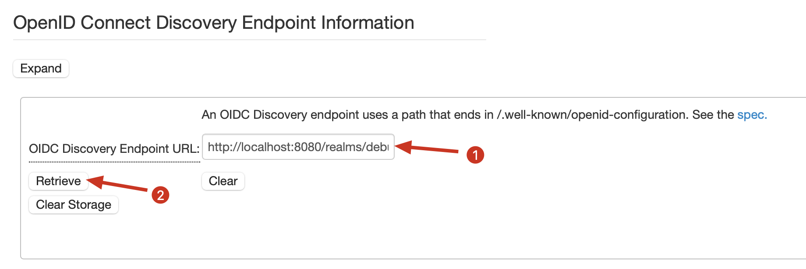
3. Scroll down to end of Discovery Endpoint Information table and click "Populate Meta Data"
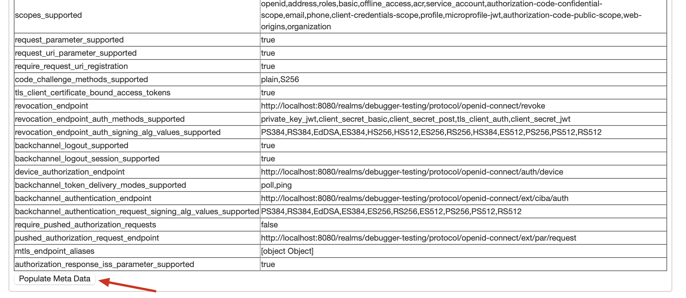
4. Expand "Configuration Parameters" and from "Authorization Grant" select "OAuth2 Client Credential"
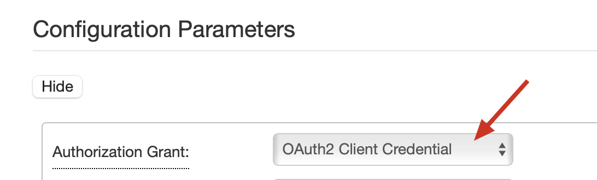
5. In "Exchange Authorization Code for Access Token", enter "Client ID", "Client Secret" and "Scope", then click "Get Token"
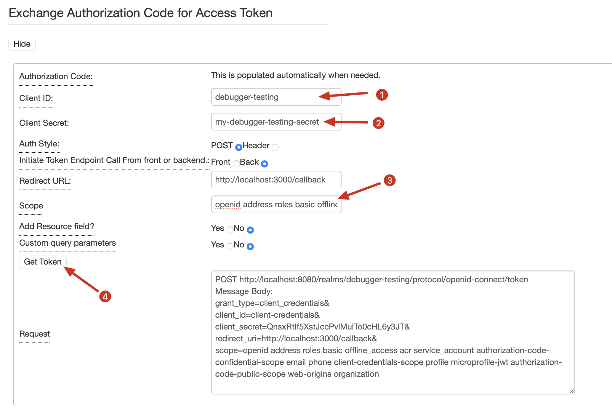
6. If successful, the debugger will return "Access token". You can view additional information for the access token if you click on the "Access token" link
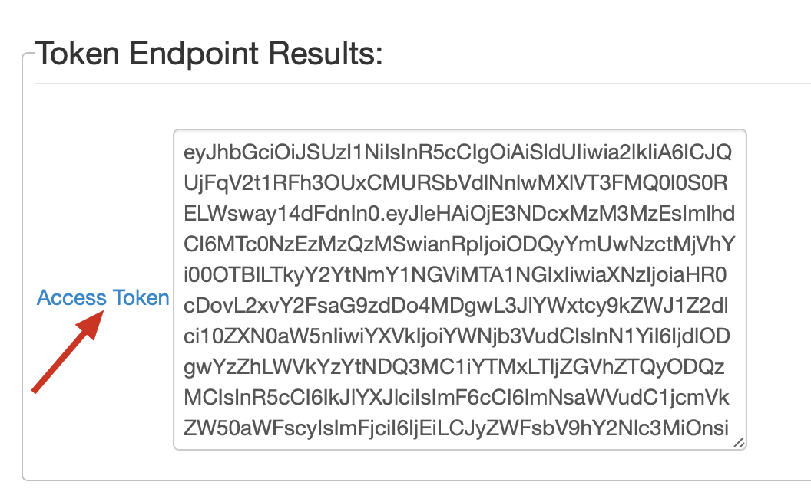
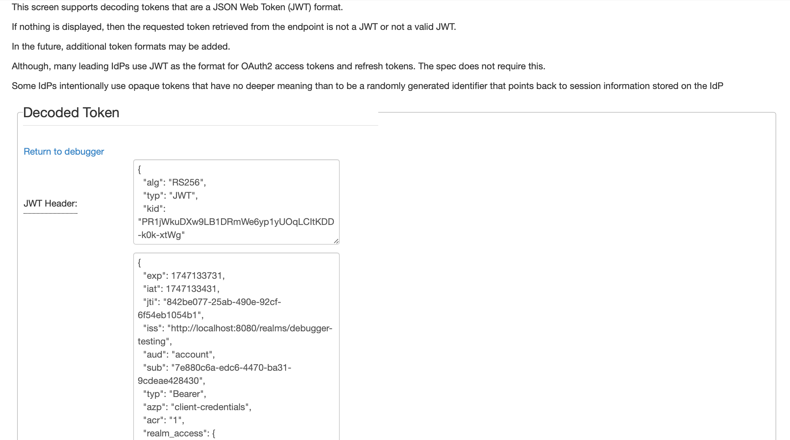

## OIDC Authorization Code Flow
1. Open http://localhost:3000
2. Expand "Metadata Retrieval", enter the "Metadata Endpoint URL" and click "Retrieve"

3. Scroll down to end of Discovery Endpoint Information table and click "Populate Meta Data"

4. Expand "Configuration Parameters" and from "Authorization Grant" select "OIDC Authorization Code Flow(code)"
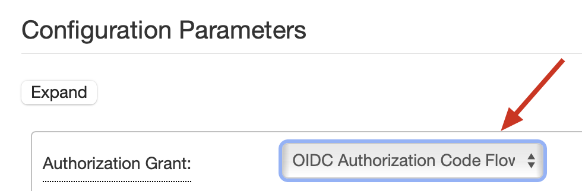
5. Optionally, you can modify the following variables:
- Display OIDC Related Artifacts?
- SSL Certificate Validation
- Use Refresh Token
- Use PKCE
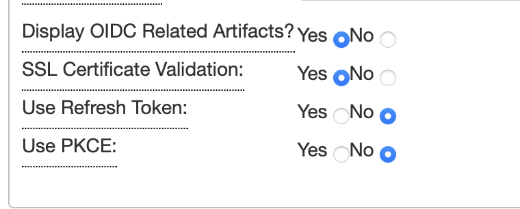
6. In "Request Authorization Code", enter "Client ID" and "Scope", then click "Authorize"
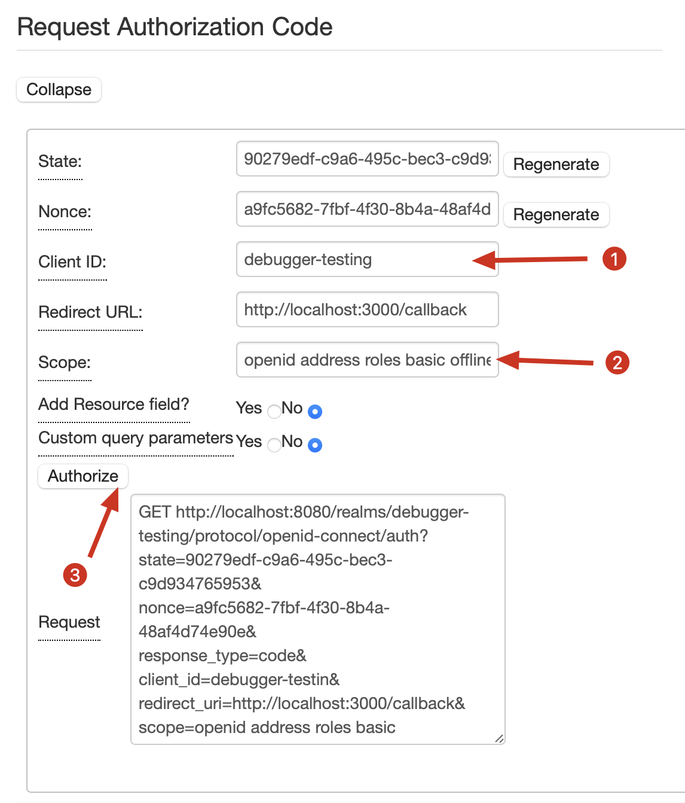
7. In the newly opened tab from the identity provider, enter "Username" and "Password", then click "Sign In"
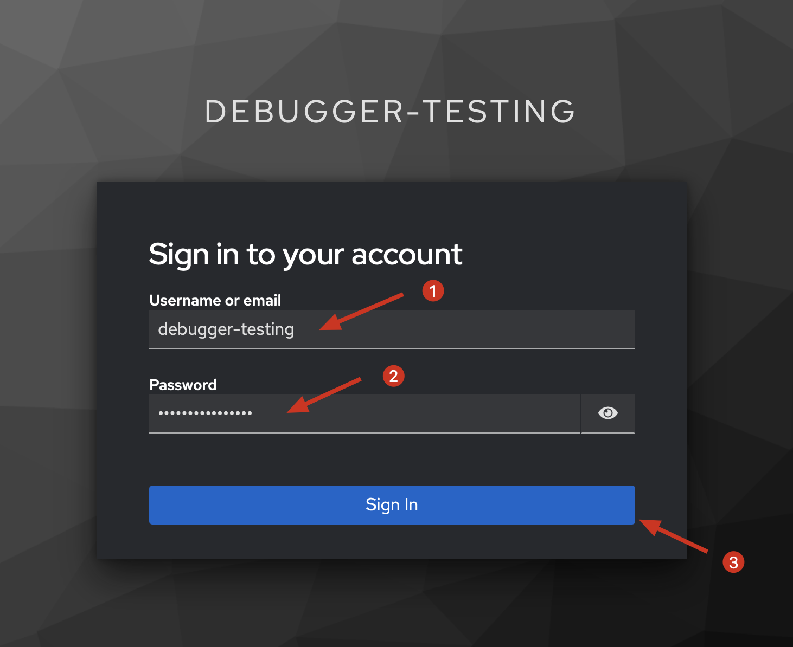
8. On successful login, you will be redirected back to the debugger page
9. In "Exchange Authorization Code for Access Token", enter "Client ID", "Client Secret" (only if client is confidential) and "Scope", then click "Get Token"

10. If successful, the debugger will return "Access token", "Refresh Token" and optionally "ID Token". You can view additional information for each of the tokens if you click on their links (1). You can also introspect the access and refresh token using the identity provider introspection endpoint (2). For ID tokens, you can also decode their userinfo data (3)
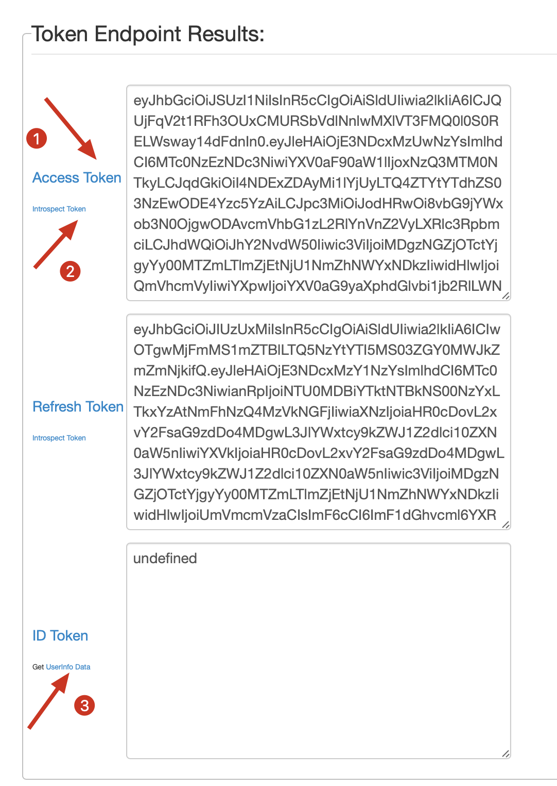
